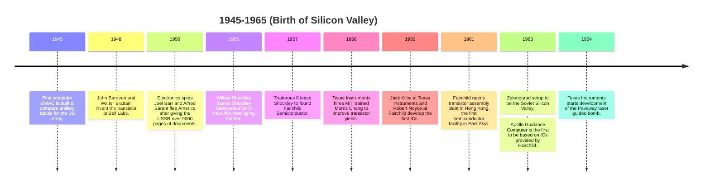
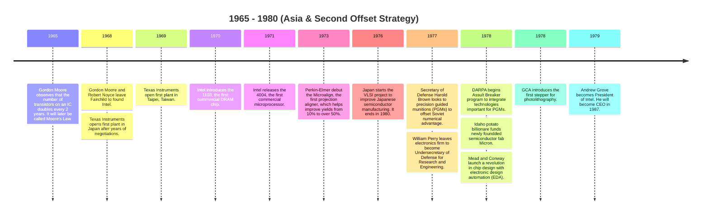
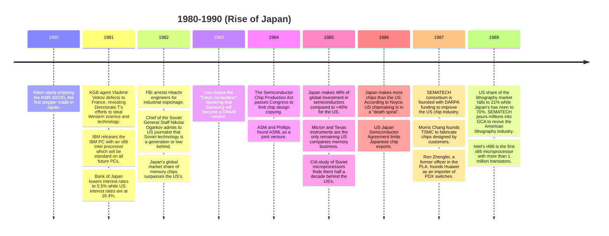
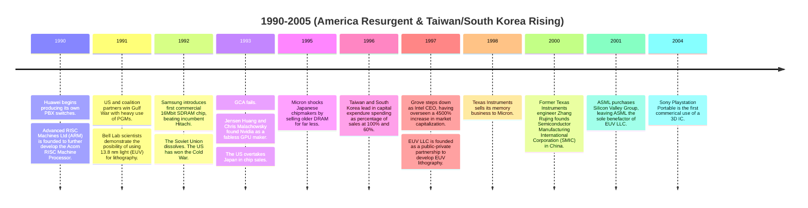
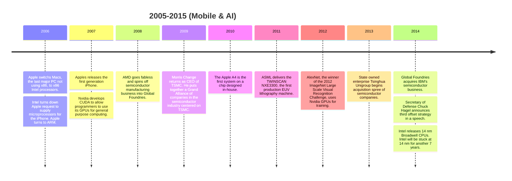
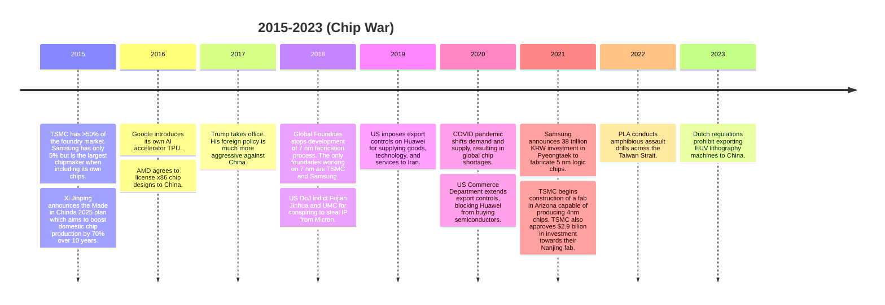

*Chip War*, despite its title, is only partly about the current US-China chip war. On one side is the US and its allies trying to prevent China from developing the capabilities to produce cutting edge chips. On the other side is China trying to achieve self-sufficiency in chip manufacturing. *Chip War* is really the story of the entire semiconductor industry from the invention of the transistor to a world where billions of people carry billions of transistors on them at all times. I charted the major events mentioned in the book in the timelines below. The titles are my own.

I knew some of the history that Miller talks about: the invention of the semiconductor at Bell Labs, the traitorous 8, Moore's law, and the founding of Intel are Silicon Valley lore. But most of the events in the book were new to me. I didn't know how early Silicon Valley companies offshored manufacturing to Asia, how Japan overtook the US as the global leader in chipmaking, or how America—with Taiwan and South Korea—retook the crown. I certainly knew nothing about the Soviet semiconductor industry; I assumed there wasn't one. Another surprise was the centrality of semiconductors to economies and militaries by the 1980s. Then, as now, the US government made an effort to preserve the US chip industry against Japanese and Asian competition because it needed a secure supply of chips for its missiles, planes, and ships.

Another theme of the book is the global semiconductor supply chain. There are the foundries that manufacture chips, the fabless semiconductor companies that design chips, the lithography and materials companies that make the machines that make the chips, and the software companies that develop electron design automation (EDA) software. Yet, due to the ever greater capital required to shrink chips, the supply chain has consolidated into a few firms in a few countries. Taiwan and South Korea are home to the biggest fabs: TSMC and Samsun. The maker of the only EUV lithography machine, ASML, is Dutch. The best chip designers and chip design software developers are American: Nvidia, AMD, Qualcomm, Cadence, Synopsys, and Mentor Graphics. In fact, in this ecosystem, Intel—historically America's leading chipmaker—is unusual for designing and fabricating its own chips.

These firms are bottlenecks in the chip supply chain and the objects of the US-China chip war. By limiting access to EDA software and lithography machines, China won't be able to design and fabricate domestic chips. Then by imposing export restrictions, China won't be able to buy the most advanced chips. Without the most advanced chips, China will be behind its rivals in technologies like AI, robotics, and big data. While these measures will hurt, I doubt China will be set so far behind. [Already, China can make 7 nm chips.](https://www.bloomberg.com/news/features/2023-09-04/look-inside-huawei-mate-60-pro-phone-powered-by-made-in-china-chip) *Chip War* is full of examples of countries investing in their semiconductor industries, catching up, and exceeding incumbents. Why should China be so different?

The computer chip is the hardware that powers the world of software in which we spend our lives. *Chip War* is a great book that tells the twists and turns of how that chip became the world's most crucial technology.
