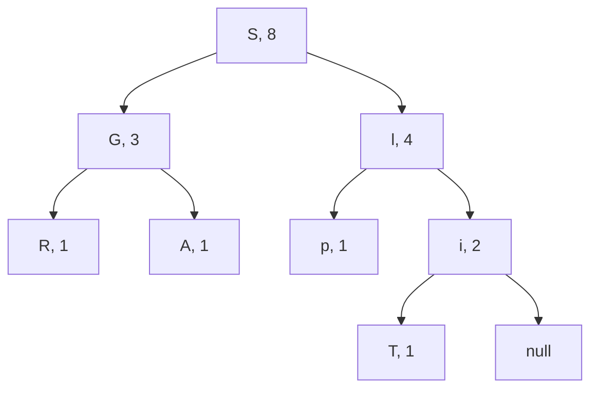
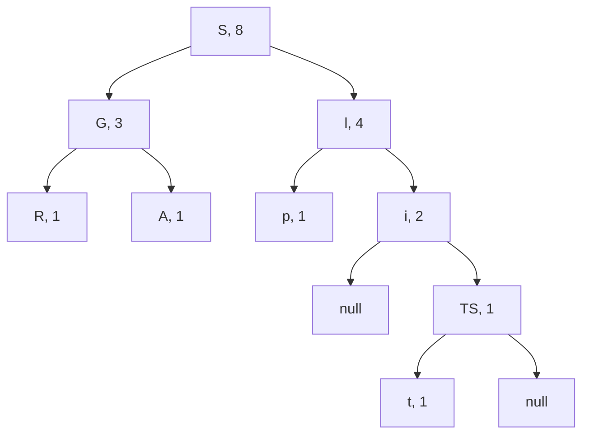

## Introduction

Back in 2017, I used Atom as my primary text editor. It was pretty and customizable—some features like [GitHub integration](https://github.atom.io/), [running Python code inline](https://atom.io/packages/hydrogen), or [syntax tree based highlighting](https://github.blog/2018-10-31-atoms-new-parsing-system/) still have no counterpart in other popular text editors—but very slow. It is an Electron[^1] app and not a particularly efficient one. A single Atom window would routinely consume 1GB or more of memory. So I was excited when I heard about [Xray](https://github.com/atom-archive/xray), a new project on GitHub by GitHub that might serve as a replacement for Atom. The codebase was primarily in Rust, giving it the speed and lightness Atom lacked. People on the <atom.io> forums thought it might become Atom 2.0.

Inside Xray, text is represented as a **conflict-free replicated data type** (CRDT). Each machine keeps its own version or **replica** of the data structure on which users make local changes. Differing replicas can then be merged in a consistent manner without relying a central coordinating server. There is no conflict having multiple differing replicas. Since merges may be performed with as few as 2 replicas, we can consider it a binary operation $+$, albeit one that is mostly used in place. For the merge operation to be invariant to operation order, $+$ should be associative and commutative (hence the use of additive notation).



Suppose we have $a, b, c$ replicas that should merge consistently in any order. That is, we want to be able to rearrange $(a + b) + c$ without changing the value of the expression. If $+$ is commutative, we can swap the replicas within the parentheses as is.

$$
(a + b) + c = (b + a) + c \qquad\text{commutative property}
$$

To swap across parentheses, we need to be about to shift the parentheses.

$$
\begin{align*}
(a + b) + c &= a + (b + c) &&\text{associative property} \\
&= a + (c + b) &&\text{commutative property} \\
&= (a + c) + b &&\text{associative property}
\end{align*}
$$

With enough pairwise swaps, we can arbitrarily reorder this expression.

After Microsoft's purchase of GitHub, it now owned Atom along with the more popular and performant VSCode. Atom was redundant. Over the course of year, updates became smaller and less frequent. By mid-2019, posts on <https://blog.atom.io/> stopped. The Xray project was [archived](https://github.com/atom-archive/xray/pull/183) on GitHub. Development effort was redirected to VSCode where it soon surpassed Atom in overall features. I switched to VSCode permanently in Fall 2019. While Xray/Atom 2.0 may have failed, CRDTs have just started to succeed, seeing usage in applications from [databases to chat messages to text editors](https://crdt.tech/implementations). Perhaps their greatest feature is equality; no replica is privileged over others. In a computing ecosystem that is all too centralized, CRDTs could help power the more distributed apps of the future.

## Basic CRDTs

### Counters

The most basic CRDT is the **grow only counter** which can only be incremented. Suppose we have peers $1, \dots, n$ in a computer network. A grow only counter $A$ is a $n$-tuple where $A_i$ counts the number of increases by peer $i$. The value of the grow-only counter is the sum of all entries $A_1 + \dots + A_n$. Merges with another grow-only counter $B$ are performed by setting $A_i = \max(A_i, B_i)$ for each $1 \leq i \leq n$.

Why do we need to track increments individually for each peer? Why couldn't we use a single register whose value is the total number of increments? Suppose we have 3 counters $a, b, c$ connected over the Internet. Replica $a$ wants to merge with replicas $b$ and $c$, but replica $c$ has already merged with replica $b$. So replica $a$ effectively merges with replica $b$ two times, but this should have no effect on the final result.

$$
a + b = a + b + b
$$

Merges should be idempotent. The addition of integers is not idempotent. The $\max(\cdot, \cdot)$​​​ of integers is however; repeated elements do not change the maximum of a set.

$$
\max(\max(a, b), b) = \max(a, b)
$$

Since only peer $i$ can increment its entry in the grow-only counter, its replica will have the largest $i$th entry in the system. Merges with every other replica are guaranteed to produce an accurate grow only counter. The Github repo containing basic CRDT implementations is <https://github.com/GeorgeRPu/Conflict-Free-Replicated-Data-Types>.

```cpp
class GCounter {
private:
    int n;        // number of peers
    int peer_id;  // unique id between 0 and n - 1
    int* inc;     // number of incremements for each peer
public:
    GCounter(int peer_id, int n) {
        assert(peer_id < n);
        this->peer_id = peer_id;
        this->n = n;
        inc = new int[n];
    }

    void increment() {
        inc[peer_id] += 1;
    }

    int value() {
        int value = 0;
        for (int i = 0; i < n; i++) {
            value += inc[i];
        }
        return value;
    }

    void merge(GCounter* other) {
        for (int i = 0; i < n; i++) {
            inc[i] = inc[i] > other->inc[i] ? inc[i] : other->inc[i];
        }
    }
};
```

We can create a **positive-negative counter** out of two grow-only counters. One tracks the number of increments for each peer in the system. The other tracks the number of decrements for each peer in the system. Why can't we just allow decrements on a grow-only counter? Consider two grow-only counters $A = (0, 0), B = (0, 0)$ in a system containing two machines.

| Order | Action                          | A        | B        |
| ----- | ------------------------------- | -------- | -------- |
| 1     | Peer 1 increments $A$           | $(1, 0)$ | $(0, 0)$ |
| 2     | Peer 2 merges with $B$ with $A$ | $(1,0)$  | $(1, 0)$ |
| 3     | Peer 1 decrements $A$           | $(0, 0)$ | $(1, 0)$ |

Now if Peer 2 tries to perform another merger, it will not accept the decrement: $B$ will remain $(1, 0)$. In fact, there is no merger rule that will work, because $A$ could have any value from any number of increments and decrements. One solution might be to trust $A$'s first entry over $B$'s, but now certain replicas have higher status than others. They are unequal.

```cpp
class PNCounter {
private:
    int n;          // number of peers
    int peer_id;    // unique id between 0 and n - 1
    GCounter* inc;  // increment gcounter
    GCounter* dec;  // decrement gcounter
public:
    PNCounter(int peer_id, int n) {
        inc = new GCounter(peer_id, n);
        dec = new GCounter(peer_id, n);
    }

    void increment() {
        inc->increment();
    }

    void decrement() {
        dec->increment();
    }

    int value() {
        return inc->value() - dec->value();
    }

    void merge(PNCounter* other) {
        inc->merge(other->inc);
        dec->merge(other->dec);
    }
};
```

### Sets

The most basic collection is a set. Elements are either members or they are not. The simplest set CRDT is the **grow-only set** where only additions are allowed. Replicas are merged by taking the union.

$$
A = A \cup B
$$

The union in akin to the $\max$ operation used for the grow only counter. We can order sets by inclusion. That is, $A \leq B$ if and only if $A \subseteq B$. The union is then the smallest set that is greater than $A$ and $B$, just as $\max(a, b)$ is the smallest element that is greater than the two numbers $a$ and $b$. However, because inclusion is a partial order (not every pair of sets are comparable), the union is generally not $A$ or $B$​.


Arrows indicate greater than relationships.

```cpp
#include <unordered_set>;

template <class T>;
class GSet {
private:
    std::unordered_set<T>; set;
public:
    GSet() {}

    void add(T el) {
        set.insert(el);
    }

    bool has(T el) {
        return set.find(el) != set.end();
    }

    void merge(GSet<T>;* other) {
        for (T el : other->set) {
            set.insert(el);
        }
    }
};
```

Like the positive-negative counter, we can construct a full set CRDT from a pair of grow-only sets. One grow-only set $A$ records all the elements added. The other grow-only set $R$ records all the elements removed. If an element $x \in A$ but $x \notin R$ or vice versa, $x$'s membership in the set is clear. If $x \in A$ *and* $x \in R$, we need a mechanism to break the tie. One option is to resolve the tie is to prefer removals over additions (or additions over removals). If $x \in A$ *and* $x \in R$, we could say $x$ is not in the set. How $x$ be removed from the set if it was not first made a member? The removal is assumed to have occurred last.

We can explicitly determine which operation was last if we record the time each addition/removal took place. For each element in $A$​ or $R$​, we store the timestamp in a hashmap[^2]. To determine set membership in the case $x \in A, x \in R$​, we check the timestamp of the addition/removal, with the last one winning. For this reason, this CRDT is called a **last write wins set**. To merge the hashmaps, we just use the later timestamp.

```cpp
#include <chrono>;
#include <unordered_map>;

using time_point = std::chrono::time_point<std::chrono::system_clock>>;

template<class T>;
class LWWSet {
private:
    GSet<T>;* add_set;                             // element additions
    GSet<T>;* rm_set;                              // element removals
    std::unordered_map<T, time_point>; add_times;  // timestamps for element additions
    std::unordered_map<T, time_point>; rm_times;   // timestamps for element removals
public:
    LWWSet() {
        add_set = new GSet<T>;();
        rm_set = new GSet<T>;();
    }

    void add(T el) {
        add_set->add(el);
        add_times[el] = std::chrono::system_clock::now();
    }

    void remove(T el) {
        rm_set->add(el);
        rm_times[el] = std::chrono::system_clock::now();
    }

    bool has(T el) {
        if (!add_set->has(el)) {
            return false;
        // add_set must have el
        } else if (!rm_set->has(el)) {
            return true;
        // both add_set and rm_set have el
        } else {
            // favors removes if timestamps are identical
            return add_times[el] > rm_times[el] ? true : false;
        }
    }

    void merge(LWWSet<T>;* other) {
        add_set->merge(other->add_set);
        rm_set->merge(other->rm_set);
        for (std::pair<T, time_point>; x : other->add_times) {
            T el = x.first;
            time_point timestamp = x.second;
            if (add_times.find(el) == add_times.end() || el > add_times[timestamp]) {
                add_times[el] = timestamp;
            }
        }
        for (std::pair<T, time_point>; x : other->rm_times) {
            T el = x.first;
            time_point timestamp = x.second;
            if (rm_times.find(el) == rm_times.end() || timestamp > rm_times[el]) {
                rm_times[el] = timestamp;
            }
        }
    }
};
```

## Building a Collaborative Text Editor

### RGA

We can represent text as a variable length sequence of characters. In order to read/write to the text, we need the following operations.

- `char get(int i)`. Returns the character at position $i$.
- `void insert(int i, char charachter)`. Inserts a character after position $i$.
- `void remove(int i)`. Marks the character at position $i$ as a tombstone (deleted).
- `void update(int i, char character)`. Set the character at position $i$ Note that we could accomplish an update by removing the existing character at position $i$ and inserting the character after position $i - 1$.

**Replicated growable array (RGA)** is a CRDT that supports these operations . Ironically, it is a linked list of nodes. Each node has an **identifier**, a last update/remove timestamp, a character, and a pointer to the next node. The identifier is the tuple $(insertion\_time, inserting\_machine\_id)$.

```cpp
#include <chrono>;
#include <unordered_map>;

using time_point = std::chrono::time_point<std::chrono::system_clock>;

struct Node {
    int peer_id;
    time_point insertion_time;
    time_point last_updated_time;
    char character;
    Node* next;

    Node(int peer_id, char character, Node* next) {
        this->peer_id = peer_id;
        insertion_time = std::chrono::system_clock::now();
        last_updated_time = std::chrono::system_clock::now();
        this->character = character;
        this->next = next;
    }
};
```

The get and update operations work identically to their regular linked list counterparts. For convenience, we define a `Node* node_at(int i)` method that grabs the $i$th item in the RGA by looping through `next` pointers.

- We can get character $i$ by returning the character field of the `node_at(i)`.
- We can update a character by setting `node_at(i)->character` to the new character. We also refresh the `last_updated_time`.

Instead of actually removing node, we set them to a special, 0 byte, tombstone character. Tombstones will not be included when displaying the RGA.

```cpp
const char TOMBSTONE = '\0';

class RGA {
private:
    int peer_id;
    Node* head;

    Node* node_at(int i) {
        Node* node = head;
        for (int counter = 0; counter < i; counter++) {
            node = node->next;
        }
        return node;
    }

public:
    RGA() {
        head = nullptr;
    }

    char get(int i) {
        return node_at(i)->character;
    }

    void remove(int i) {
        Node* node = node_at(i);
        node->c = TOMBSTONE;
        node->last_updated_time = std::chrono::system_clock::now();
    }

    void update(int i, char character) {
        Node* node = node_at(i);
        node->character = character;
        node->last_updated_time = std::chrono::system_clock::now();
    }
};
```

Insertions are different. We cannot always add a new node to the exact right of the `node_at(i)` in order to preserve the intentions of other inserts. If we order identifiers lexicographically—by their first item and, in case of a tie, by their second item—then an inserted node with a succeeding identifier must, in general, be inserted later. The intention of the later insert should have higher priority. Hence, we put new node nearer the `node_at(i)`.


Figure taken from . In , a hashmap is used to map identifiers to nodes, which we have omitted.

It remains to show that this insertion rule is invariant to the order of the insertions, which we do by example. Suppose 3 peers work on a collaborative document. The initial state of RGA is $[n_1, n_5]$ with respective identifiers $i_1 = (0, 2)$ and $i_5 = (2, 1)$. The peers insert a node just after $n_1$ without any intervening merges.

1. Operation $o_4$: Peer 0 inserts $n_4$, whose identifier is $i_4 = (0, 3)$.
2. Operation $o_3$: Peer 1 inserts $n_3$ with $i_3 = (1, 4)$.
3. Operation $o_2$: Peer 2 inserts $n_2$ with $i_2 = (2, 5)$.

Therefore, $i_2 < i_3 < i_4 < i_5$. The result below shows for each peer a different execution order, which nonetheless reach a convergent state.

$$
\begin{align*}
&[n_1, n_5] \stackrel{o_4}{\longrightarrow} [n_1, n_4, n_5] \stackrel{o_2}{\longrightarrow} [n_1, n_2, n_4, n_5] \stackrel{o_3}{\longrightarrow} [n_1, n_2, n_3, n_4, n_5] \\
&[n_1, n_5] \stackrel{o_3}{\longrightarrow} [n_1, n_3, n_5] \stackrel{o_2}{\longrightarrow} [n_1, n_2, n_3, n_5] \stackrel{o_4}{\longrightarrow} [n_1, n_2, n_3, n_4, n_5] \\
&[n_1, n_5] \stackrel{o_2}{\longrightarrow} [n_1, n_2, n_5] \stackrel{o_3}{\longrightarrow} [n_1, n_2, n_3, n_5] \stackrel{o_4}{\longrightarrow} [n_1, n_2, n_3, n_4, n_5]
\end{align*}
$$

### RGASplit

One problem with RGA is that node retrieval can be slow, with a time complexity of $O(n)$. The method `node_at(int i)` must loop through $i$ nodes to get the desired node. As our text grows to a considerable size, a collaborative text editor using RGA will slow down. **RGASplit** solves this problem by arranging non-tombstone nodes into a binary tree . Each node stores an additional weight that counts the number of nodes in its subtree along with obligatory left and right pointers.


Figure taken from .

```cpp
#include <chrono>;
#include <unordered_map>;

using time_point = std::chrono::time_point<std::chrono::system_clock>;

struct Node {
    // RGA
    time_point insertion_time;
    time_point last_updated_time;  // updates or removes
    char character;
    Node* next;
    // RGASplit
    int weight;
    Node* left;
    Node* right;

    Node(char character, Node* next) {
        insertion_time = std::chrono::system_clock::now();
        last_updated_time = std::chrono::system_clock::now();
        this->character = character;
        this->next = next;
    }
};
```

The weights are used to navigate the binary tree. Say we want to find the $i$th character in the below binary tree.

- The 4th character. We start at the root of the tree and see that the left subtree contains the first 3 characters while the right subtree contains the last 4 characters. Thus, the 4th character is "S".
- The 1st character. We start at the root again. It has a left subtree which contains preceding characters. Looking at the "G" node, we notice it too has an active left pointer. Since "R" has no children, it is the first character.
- The 7th character. Starting from the root, we now go down the right subtree, since $7 > 3 + 1$. Because there are 4 characters outside this subtree, the 7th character in the entire tree is equivalent to the 3rd character in the right subtree. At the "i" node, we see that there is a "p" character on the left and a 2-weight subtree on the right. Finally, we reach the "i" node and see that it is the 7th character.



To add nodes, RGASplit uses the usual binary tree insertion logic. You move left/right down the tree until you reach a non-branch (one left or right pointer is not `nullptr`). To change the capital "T" to a lowercase "t", we need to delete it and insert the lowercase "t" after "i". The delete operation navigates the tree using the same logic as above to retrieve the proper node, setting its character to tombstone (shortened to TS). The insert operation first navigates to the location of the "i" node. We know that "t" should be immediately after "i", since "t" has a later insertion time than the tombstone character. We go to the right and arrive at the tombstone character, where "t" is attached to its left pointer.



Note that there are multiple binary trees that could represent the same ordering of objects. RGASplit treats these similarly, allowing each peer to self-balance its binary tree as it sees fit.

## Beyond Shared Documents

CRDTs are a young invention. WOOT—"the first CRDT algorithm proposed for group editing"—was published in 2006. The first CRDTs were a reaction to an older technology **operation transform** (OT). OT would transform successive operations to be compatible with preceding operations. Many OT algorithms turned out to be incorrect. One of the few that was—and ended up powering Google Docs—required all traffic go through a central server. And while their origins might revolve around collaborative editing a la Google Docs, their future does not have to be. CRDTs allow for decentralized versions of many web-apps, but CRDTs could be used in multithreaded programs to maximize usage of multiple cores. This was how CRDTs would be used in X-ray, allowing multiple extensions to tamper with the text simultaneously without fear of inconsistency.

<iframe style="iframe { aspect-ratio: 560/315; height: auto; width: 100%; }" height="315" width="550" src="https://www.youtube.com/embed/x7drE24geUw" title="YouTube video player" frameborder="0" allow="accelerometer; autoplay; clipboard-write; encrypted-media; gyroscope; picture-in-picture" allowfullscreen></iframe>

CRDTs are seeing increasing use in a variety of [very popular applications](https://crdt.tech/implementations). Engineers are improving available open source implementations, making them smaller and faster. Researchers are working on expanding the scope of CRDTs, such as to all JSON objects . CRDTs are getting better and better. I do not think this will stop anytime soon.

## References



---

[^1]: Electron was originally named [Atom Shell](https://www.electronjs.org/blog/electron) because it was built for the Atom editor. Because the electrons orbiting atoms in pictures form a kind of shell, Electron was chosen as the new name.
[^2]: In a distributed system, there may not be an agreed upon time. That is, multiple computers' clocks give different times. In this case, the sum of the <a href="https://en.wikipedia.org/wiki/Vector_clock">vector clock</a> can be used. A vector clock tracks the time of each machine in the system, updated by regular time messages. However, most modern computers can get an accurate time with millisecond level precision, so long as they're connected to the Internet to receive regular synchronization messages.
