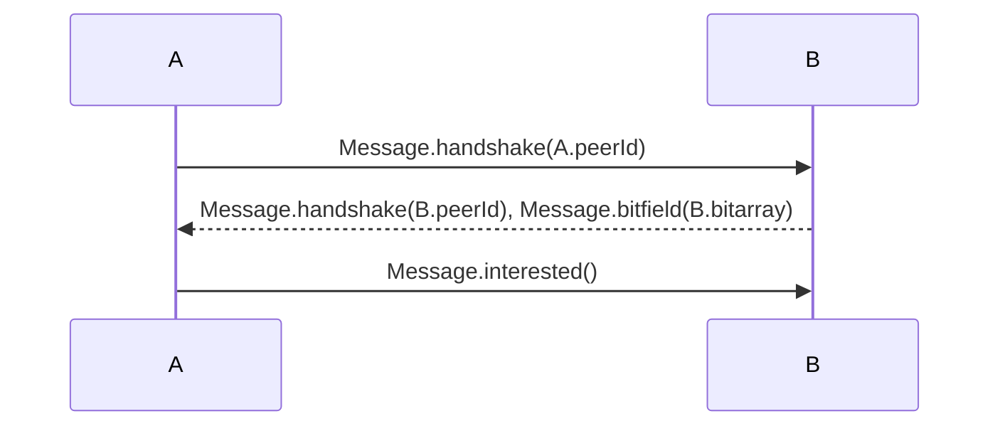
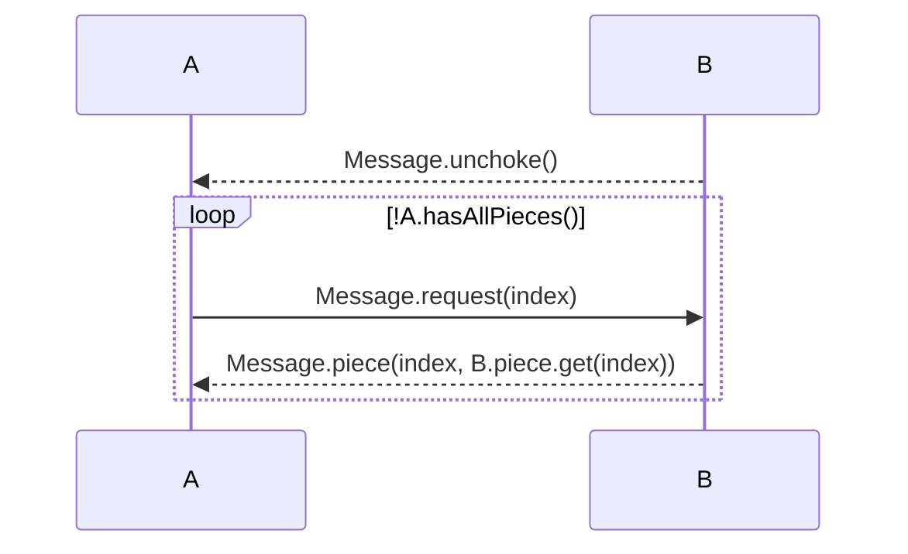

A common project in computer networking classes is implementing the peer-to-peer (P2P) file transfer protocol BitTorrent[^1]. Like many students, the design was hastily conceived and the code shabbily written. After all, I just needed to produce a working implementation, which would never be revisited. However, I thought it would be an instructive exercise to rewrite my project code, seeing where I went wrong and what could be done to fix it. The GitHub repo containing all 3 implementations is <https://github.com/GeorgeRPu/BitTorrent-like>. Snippets will be reproduced here. For the sake of brevity, the implementation for many functions are omitted along with import statements.

## BitTorrent Specification

BitTorrent works by dividing a file into indexed fixed size pieces which are then distributed across a **torrent**, a group of hosts or **peers** exchanging pieces. A peer's **neighbors** are the subset of a torrent it connects to. A **tracker** tracks the peers in a torrent. New peers joining a torrent register with the tracker and get a list of participating peers. After registering, peers open a TCP connection with some peers in the torrent. Once the opposing peers accept the connection, the BitTorrent protocol begins.

The connecting peer sends a handshake message.

- It starts with 19 followed by "BitTorrent protocol". The 19 is a length prefix.
- After this header are 8 reserved bytes of 0's. The remaining data are big-endian 32 bit integers.
- Next is the 20 byte SHA1 hash of the info value (obtained from the tracker). If both peers in a connection don't transmit the same hash, the connection is closed.
- Last is the 20 byte peer ID.

Once both sides handshake, they begin sending regular messages. Their format is a 4-byte length not including itself, a 1-byte type, and a variable length payload. The file sharing protocol is tit-for-tat: the peers sending the most pieces are unchoked, while the remaining neighbors are choked (no pieces transferred). In addition to these, a random neighbor is optimistically unchoked periodically.

| Message            | Payload                                                 | When sent                                                    |
| ------------------ | ------------------------------------------------------- | ------------------------------------------------------------ |
| 0 - choke          |                                                         | Periodically                                                 |
| 1 - unchoke        |                                                         | Periodically                                                 |
| 2 - interested     |                                                         | In response to have/bitfield if peer                      |
| 3 - not interested |                                                         | Same as interested                                           |
| 4 - have           | 32 bit index of piece just downloaded                   | To neighbors after downloading piece                         |
| 5 - bitfield       | Bitarray of pieces the peer possesses                   | As first message                                             |
| 6 - request        | 32 bit index of desired piece, begin and length offsets | In response to unchoke or piece                              |
| 7 - piece          | 32 bit index of piece just sent, file piece             | In response to request; may be pipelined                     |
| 8 - cancel         | same as request                                         | If downloading same piece from multiple peers, cancel other downloads after first completes |

More details can be found at <https://www.bittorrent.org/beps/bep_0003.html>.

For the project, there are a few simplifications.

1. **No torrents, no trackers**. The peers are started simultaneously with peer ID, hostname, and port information stored in a `PeerInfo.txt` file. The fourth field `hasFile` is 1 if the peer starts with the entire file and 0 otherwise. All peers connect and handshake with each other.

   The remaining configuration parameters—unchoking interval, optimistic unchoking interval, piece size—are stored in `Common.cfg` as `key=value` pairs on separate lines.
2. **Request-piece**. Requests only has index as the payload. Only one piece is sent following a request. There is no cancel message.

## First Attempt

The implementation contains 4 Java classes.

### Config

Before we can begin file sharing, we need to extract configuration settings from `Common.cfg` and `PeerInfo.cfg`. The Java [Properties](https://docs.oracle.com/en/java/javase/11/docs/api/java.base/java/util/Properties.html) class manages configuration parameters as String key-value pairs. The `load` method loads the data in a config file into a Properties object. However, most configuration values are integers and don't need to be modified, so Config wraps Properties with a simple getter interface.

```java
public class Config {
    private final Properties prop = new Properties();

    public Config(String filename) {
        try {
            FileInputStream in = new FileInputStream(filename);
            prop.load(in);
        } catch (IOException e) {
            System.err.println(e.toString());
        }
    }

    public int getInt(String key) {
        return Integer.parseInt(prop.getProperty(key));
    }

    public String getString(String key) {
        return prop.getProperty(key);
    }
}
```

### Message

The [Message](https://github.com/GeorgeRPu/BitTorrent-like/blob/main/java1/Message.java) class contains static methods for creating different messages. Each message is an array of bytes. Because, messages often contain various 32 bit integers as 4 sequential bytes, the Message class has a `intToByteArray` helper method. The Message class also contains a `typeOf` method which returns the message type as a lowercase String. To prevent issues with misspellings, the Strings are stored as static variables.

```java
public class Message {

    public static String HANDSHAKE = "handshake";
    public static String CHOKE = "choke";
    public static String UNCHOKE = "unchoke";
    public static String INTERESTED = "interested";
    public static String NOT_INTERESTED = "not interested";
    public static String HAVE = "have";
    public static String BITFIELD = "bitfield";
    public static String REQUEST = "request";
    public static String PIECE = "piece";

    private static String P2PFILESHARINGPROJ = "P2PFILESHARINGPROJ";

    public static byte[] handshake(int peerId) {
        byte[] msg = new byte[32];
        byte[] header = P2PFILESHARINGPROJ.getBytes();
        System.arraycopy(header, 0, msg, 0, 18);
        byte[] peerIdBytes = intToByteArray(peerId);
        System.arraycopy(peerIdBytes, 0, msg, 28, 4);
        return msg;
    }

    public static byte[] choke();
    public static byte[] unchoke();
    public static byte[] interested();
    public static byte[] notinterested();
    public static byte[] have(int index);
    public static byte[] bitfield(BitSet bitarray);
    public static byte[] request(int index);
    public static byte[] piece(int index, byte[] filePiece);

    public static String typeOf(byte[] msg) {
        byte msgType = msg[4];
        byte[] handshakeHeader = Arrays.copyOfRange(msg, 0, 18);
        if (new String(handshakeHeader).equals(P2PFILESHARINGPROJ)) {
            return HANDSHAKE;
        } else if (msgType == 0) {
            return CHOKE;
        } else if (msgType == 1) {
            return UNCHOKE;
        } else if (msgType == 2) {
            return INTERESTED;
        } else if (msgType == 3) {
            return NOT_INTERESTED;
        } else if (msgType == 4) {
            return HAVE;
        } else if (msgType == 5) {
            return BITFIELD;
        } else if (msgType == 6) {
            return REQUEST;
        } else if (msgType == 7) {
            return PIECE;
        } else {
            return "INVALID";
        }
    }

    private static byte[] intToByteArray(int n);
}
```

### Peer

The [Peer](https://github.com/GeorgeRPu/BitTorrent-like/blob/main/java1/Peer.java) class is the core of the program. It stores the peer ID, hostname, port, several configuration variables, reads the file to be shared if necessary, and initializes a `numPieces = fileSize / pieceSize + (fileSize % pieceSize == 0? 0 : 1)` length [BitSet](https://docs.oracle.com/en/java/javase/11/docs/api/java.base/java/util/BitSet.html) that tracks which file pieces have been downloaded.

```java
public class Peer implements Runnable {
    public final int peerId;
    public final String hostname;
    public final int port;
    private final int hasFile;
    private final int numPieces;
    private final int numPrefNeighbors;
    private final int optimisticUnchokingInterval;
    private final int unchokingInterval;
    private final int pieceSize;
    private final String filename;
    private final BitSet bitarray;
    private final List<Peer> neighborsToConnect;

    private final Map<Integer, byte[]> pieces = new ConcurrentHashMap<>();

    public Peer(int peerId, String hostname, int port, int hasFile, Config config, List<Peer> peers) {
        this.peerId = peerId;
        this.hostname = hostname;
        this.port = port;
        this.hasFile = hasFile;
        this.numPrefNeighbors = config.getInt("NumberOfPreferredNeighbors");
        this.optimisticUnchokingInterval = config.getInt("OptimisticUnchokingInterval");
        this.unchokingInterval = config.getInt("UnchokingInterval");
        this.pieceSize = config.getInt("PieceSize");
        this.filename = config.getString("FileName");
        this.neighborsToConnect = new ArrayList<>(peers);

        int fileSize = config.getInt("FileSize");
        numPieces = fileSize / pieceSize + (fileSize % pieceSize == 0? 0 : 1);
        bitarray = new BitSet(numPieces);
        bitarray.clear();
        if (hasFile == 1) {
            readFile(numPieces);
            bitarray.set(0, numPieces, true);
        }
    }

    private void readFile(int numPieces) {
        try {
            FileInputStream in = new FileInputStream(filename);
            for (int i = 0; i < numPieces; i++) {
                byte[] piece = new byte[pieceSize];
                in.read(piece);
                pieces.put(i, piece);
            }
        } catch (IOException e) {
            System.err.println(e.toString());
        }
    }
}
```

#### Run

After a peer is created, it needs to start opening and accepting connections. Java has a simple [Socket](https://docs.oracle.com/en/java/javase/11/docs/api/java.base/java/net/Socket.html) class for initiating TCP connections to `hostname:port` and [ServerSocket](https://docs.oracle.com/en/java/javase/11/docs/api/java.base/java/net/ServerSocket.html) for accepting incoming connections. After the connections are created, a task for each side of the connection is run using a thread pool. The concurrency prevents blocking while waiting for messages. Because of this concurrency, objects accessed by multiple threads must be thread-safe or protected using `synchronized`.

```java
public class Peer implements Runnable {
    private ExecutorService threadPool = Executors.newFixedThreadPool(5);

    @Override
    public void run() {
        for (Peer peer : neighborsToConnect) {
            threadPool.execute(new ConnectionHandler(peer));
            System.out.printf("Peer %s connected to Peer %s%n", peerId, peer.peerId);
        }

        try {
            ServerSocket serverSocket = new ServerSocket(port);
            while (true) {
                threadPool.execute(new ServerHandler(serverSocket.accept()));
            }
        } catch (IOException e) {
            System.err.println(e.toString());
        }
    }
}
```

#### Connection/ServerHandler

After a connection has been made/accepted, Connection/ServerHandler continue the P2P protocol logic. ConnectionHandler sends the first handshake message; the ServerHandler replies with a handshake. They are distinguished by initializing the superclass Handler's `initateHandhake` field differently. From the handshake messages, each side learns the ID of the other. Aside from this, the protocol logic is symmetric for both sides of a connection.

```java
public class Peer implements Runnable {

    private class ConnectionHandler extends Peer.Handler {

        public ConnectionHandler(Peer peer) {
            super(true);
            try {
                socket = new Socket(peer.hostname, peer.port);
            } catch (IOException e) {
                System.err.println(e.toString());
            }
        }
    }

    private class ServerHandler extends Peer.Handler {

        public ServerHandler(Socket socket) {
            super(false);
            this.socket = socket;
        }
    }
}
```

#### Handler

The Handler class contains the protocol logic. At the core is an event loop that cycles between receiving messages, replying, unchoking peers, and sending have messages (in an altered order). To ensure each stage is visited, the socket has a timeout of 1 second. The loop concludes only when all peers have all pieces: the number of `Trues` in the BitSet = `numPieces`. Hence, each peer must maintain copy BitSet's of its neighbors from the broadcasted have messages.

```java
public class Peer implements Runnable {
    private static final int RCV_TIMEOUT = 1000;

    private final Map<Integer, BitSet> neighborBitarrays = new ConcurrentHashMap<>();

    public boolean missingPieces() {
        synchronized (bitarray) {
            return bitarray.cardinality() < numPieces;
        }
    }

    public boolean neighborsMissingPieces() {
        for (BitSet otherBitarray : neighborBitarrays.values()) {
            if (otherBitarray.cardinality() < numPieces) {
                return true;
            }
        }
        return false;
    }

    private class Handler implements Runnable {
        int otherPeerId = -1;
        ObjectInputStream in;
        ObjectOutputStream out;
        RandomAccessFile raf;
        Socket socket;
        boolean initiateHandshake;

        public Handler(boolean initiateHandshake) {
            if (missingPieces()) {
                try {
                    String path = String.format("./peer_%s/%s", peerId, filename);
                    File file = new File(path);
                    file.getParentFile().mkdirs();
                    file.createNewFile();
                    raf = new RandomAccessFile(path, "rw");
                } catch (IOException e) {
                    System.err.println(e.toString());
                }
            }
            this.initiateHandshake = initiateHandshake;
        }

        public void run() {
            try {
                socket.setSoTimeout(RCV_TIMEOUT);
                out = new ObjectOutputStream(socket.getOutputStream());
                if (initiateHandshake) {
                    send(Message.handshake(peerId));
                }
                in = new ObjectInputStream(socket.getInputStream());

                while (missingPieces() || neighborsMissingPieces() || neighborBitarrays.isEmpty()) {
                    unchoke();
                    sendHaves();
                    byte[] msg = rcv();
                    if (msg != null) {
                        respond(msg);
                    }
                }

                in.close();
                out.close();
                socket.close();
                System.out.printf("Peer %s closed connection with Peer %s%n", peerId, otherPeerId);
            } catch (SocketException | EOFException e) {
                System.out.printf("Peer %s-%s connection was closed%n", peerId, otherPeerId);
            } catch (IOException | ClassNotFoundException e) {
                System.err.println(e.toString());
            }
        }

        private byte[] rcv() throws IOException, ClassNotFoundException {
            try {
                byte[] msg = (byte[]) in.readObject();
                System.out.printf("Peer %s received %s from Peer %s%n",
                        peerId, Message.typeOf(msg), otherPeerId);
                return msg;
            } catch (SocketTimeoutException e) {
                return null;
            }
        }

        private void send(byte[] msg) throws IOException;
    }
```

The `respond` method implements response behavior of the protocol. For a new peer A connecting to a peer B that has the entire file, the sequence of messages is as follows. Interest is determined by taking the difference of the two BitSets. If the difference is all `False`, then B has no pieces A does not already have.

$$
bitarray - otherBitarray = bitarray \land \neg otherBitarray
$$



Upon receiving the interested message, B adds A to its list of interested peers. Eventually, B sends an unchoke message to A. Peer A randomly selects a piece to request from the difference of the BitSets.



Once A receives a piece, it must store the piece in memory[^2] and on disk as well as mark the corresponding index BitSet as `True`. Finally, it broadcasts have messages to every other neighbor. This is achieved by maintaining a [ConcurrentLinkedQueue](https://docs.oracle.com/en/java/javase/11/docs/api/java.base/java/util/concurrent/ConcurrentLinkedQueue.html) for each `otherPeerId`. Once the respective Handler enters the `sendHaves` method, it sends all the messages in its queue.

```java
public class Peer implements Runnable {
    private final List<Integer> interestedNeighborIds = new ArrayList<>();
    private final Map<Integer, Queue<Integer>> haveQueues = new ConcurrentHashMap<>();
    private final Map<Integer, Integer> piecesReceived = new ConcurrentHashMap<>();

    private class Handler implements Runnable {

        private void respond(byte[] msg) throws IOException {
            String msgType = Message.typeOf(msg);
            if (msgType.equals(Message.HANDSHAKE)) {
                otherPeerId = byteArrayToInt(Arrays.copyOfRange(msg, 28, 32));
                haveQueues.putIfAbsent(otherPeerId, new ConcurrentLinkedQueue<>());
                if (!initiateHandshake) {
                    send(Message.handshake(peerId));
                }
                synchronized (bitarray) {
                    if (!bitarray.isEmpty()) {
                        send(Message.bitfield(bitarray));
                    }
                }
            } else if (msgType.equals(Message.HAVE)) {
                int index = byteArrayToInt(Arrays.copyOfRange(msg, 5, 9));
                neighborBitarrays.putIfAbsent(otherPeerId, new BitSet(numPieces));
                neighborBitarrays.get(otherPeerId).set(index, true);
                notifyInterest();
            } else if (msgType.equals(Message.BITFIELD)) {
                BitSet otherBitarray = BitSet.valueOf(Arrays.copyOfRange(msg, 5, msg.length));
                neighborBitarrays.put(otherPeerId, otherBitarray);
                notifyInterest();
            } else if (msgType.equals(Message.INTERESTED)) {
                synchronized (interestedNeighborIds) {
                    interestedNeighborIds.add(otherPeerId);
                }
            } else if (msgType.equals(Message.NOT_INTERESTED)) {
                synchronized (interestedNeighborIds) {
                    interestedNeighborIds.removeIf(id -> id == otherPeerId);
                }
            } else if (msgType.equals(Message.CHOKE)) {

            } else if (msgType.equals(Message.UNCHOKE)) {
                requestPiece();
            } else if (msgType.equals(Message.REQUEST)) {
                int index = byteArrayToInt(Arrays.copyOfRange(msg, 5, 9));
                send(Message.piece(index, pieces.get(index)));
            } else if (msgType.equals(Message.PIECE)) {
                int index = byteArrayToInt(Arrays.copyOfRange(msg, 5, 9));
                byte[] piece = Arrays.copyOfRange(msg, 9, msg.length);
                pieces.put(index, piece);
                raf.seek(index * pieceSize);
                raf.write(piece);
                synchronized (bitarray) {
                    bitarray.set(index);
                }
                piecesReceived.putIfAbsent(otherPeerId, 0);
                piecesReceived.put(otherPeerId, piecesReceived.get(otherPeerId) + 1);
                for (Queue<Integer> queue : haveQueues.values()) {
                    queue.add(index);
                }
                requestPiece();
            }
        }

        private int byteArrayToInt(byte[] bytes);
        private void notifyInterest() throws IOException;
        private void requestPiece() throws IOException;
        private BitSet missingBitArray();
        private void sendHaves();
    }
}
```

The last unmentioned phase is the `unchoke` method. Unchoking is done tit-for-tat at regular intervals; the peers which have sent the most pieces are allowed to request pieces. Periodically, a choked but interested peer is optimistically unchoked. In the beginning, no pieces have been sent, so no peers will be unchoked. Instead of waiting for peers to optimistically each other, peers starting with the complete file unchoke a random subset of their interested neighbors.

```java
public class Peer implements Runnable {
    private final Set<Integer> unchokedNeighborIds = ConcurrentHashMap.newKeySet();
    private final Set<Integer> toSendUnchokeIds = ConcurrentHashMap.newKeySet();
    private final Set<Integer> toSendChokeIds = ConcurrentHashMap.newKeySet();

    private long lastOptimistic = 0;
    private long lastUnchoked = 0;
    private int optimisticallyUnchokedId;

    private class Handler implements Runnable {

        private void unchoke() throws IOException {
            synchronized (interestedNeighborIds) {
                synchronized (bitarray) {
                    if (hasFile == 1 && unchokedNeighborIds.size() < numPrefNeighbors - 1
                            && interestedNeighborIds.size() >= numPrefNeighbors) {
                        Collections.shuffle(interestedNeighborIds);
                        unchokedNeighborIds.addAll(interestedNeighborIds.subList(0, numPrefNeighbors - 1));
                        toSendUnchokeIds.addAll(unchokedNeighborIds);
                    }
                    List<Integer> chokedButInterestedIds = new ArrayList<>(interestedNeighborIds);
                    chokedButInterestedIds.removeAll(unchokedNeighborIds);

                    long sinceLastOptimistic = (System.currentTimeMillis() - lastOptimistic) / 1000;
                    if (sinceLastOptimistic >= optimisticUnchokingInterval && interestedNeighborIds.size() >= 1) {
                        int randInt = ThreadLocalRandom.current().nextInt(0, chokedButInterestedIds.size());
                        int randId = chokedButInterestedIds.get(randInt);
                        if (randId != optimisticallyUnchokedId) {
                            toSendUnchokeIds.add(randId);
                            toSendChokeIds.add(optimisticallyUnchokedId);
                            optimisticallyUnchokedId = randId;
                        }
                        lastOptimistic = System.currentTimeMillis();
                    }
                    long sinceLastUnchoked = (System.currentTimeMillis() - lastUnchoked) / 1000;
                    if (sinceLastUnchoked >= unchokingInterval && piecesReceived.size() >= numPrefNeighbors - 1) {
                        List<Entry<Integer, Integer>> entries = new ArrayList<>(piecesReceived.entrySet());
                        entries.sort(Entry.comparingByValue());
                        Set<Integer> topIds = entries.subList(0,numPrefNeighbors - 1)
                                .stream().map(Entry::getKey).collect(Collectors.toSet());
                        toSendChokeIds.addAll(difference(unchokedNeighborIds, topIds));
                        toSendUnchokeIds.addAll(difference(topIds, unchokedNeighborIds));
                        unchokedNeighborIds.clear();
                        unchokedNeighborIds.addAll(topIds);
                        piecesReceived.clear();
                        lastUnchoked = System.currentTimeMillis();
                    }
                    if (toSendUnchokeIds.contains(otherPeerId)) {
                        send(Message.unchoke());
                        toSendUnchokeIds.remove(otherPeerId);
                    }
                    if (toSendChokeIds.contains(otherPeerId)) {
                        send(Message.choke());
                        toSendUnchokeIds.remove(otherPeerId);
                    }
                }
            }
        }

        private Set<Integer> difference(Set<Integer> a, Set<Integer> b);
    }
}
```

### StartPeers

The [StartPeers](https://github.com/GeorgeRPu/BitTorrent-like/blob/main/java1/StartPeers.java) class makes it easier to start the file sharing process. It reads the lines in `PeerInfo.cfg` and spins up a new Peer in separate threads.

```java
public class StartPeers {
    private static final ExecutorService threadPool = Executors.newCachedThreadPool();

    public static void main(String[] args) {
        Config config = new Config("Common.cfg");
        List<Peer> peers = new ArrayList<>();
        try {
            BufferedReader reader = new BufferedReader(new FileReader("PeerInfo.txt"));
            String line = reader.readLine();
            while (line != null) {
                String[] info = line.strip().split(" ");
                int peerId = toInt(info[0]);
                Peer peer = new Peer(peerId, info[1], toInt(info[2]), toInt(info[3]), config, peers);
                threadPool.submit(peer);
                peers.add(peer);
                line = reader.readLine();
            }
        } catch (IOException e) {
            System.err.println(e.toString());
        }
    }

    private static int toInt(String s);
}
```

## Second Attempt

There are a number of problems with this first attempted implementation.

1. **Peer**. The Peer class is nearly 400 lines with multiple methods ~50 lines. Worse, the Peer class has 3 inner classes that concurrently act on the peer's state. This results in a large number of ConcurrentHashMaps and [ConcurrentHashMap.newKeySet()](https://docs.oracle.com/en/java/javase/11/docs/api/java.base/java/util/concurrent/ConcurrentHashMap.html#newKeySet())'s. Un-thread-safe objects must be protected using `synchronized`. This is incredibly complicated and makes debugging/extending the existing Peer class difficult.
2. **Message**. The Message class is longer than it needs to be. Notably, all the non-handshake messages share a common pattern: length prefix, type byte, and payload. Even the handshake message can be shoehorned into this tripartite format. A "length" prefix of P2PFILESHARINGPROJ, 10 empty type bytes, and a 4 byte payload of the peer ID. The Message class is littered with magic numbers. For example, the type codes $0, 1, \dots, 7$ appear multiple times instead of descriptive variable names.

### MessageType

Rather than represent the message types as Strings, we create a [MessageType](https://github.com/GeorgeRPu/BitTorrent-like/blob/main/java2/MessageType.java) enum with the type codes as a public field. The handshake message is assigned a type code of 10. The `valueOf` method can be used to convert type codes into MessageType values.

```java
public enum MessageType {
    HANDSHAKE(10),
    CHOKE(0),
    UNCHOKE(1),
    INTERESTED(2),
    NOT_INTERESTED(3),
    HAVE(4),
    BITFIELD(5),
    REQUEST(6),
    PIECE(7);

    public final int code;

    MessageType(int code) {
        this.code = code;
    }

    public static MessageType valueOf(byte b) {
        for (MessageType type : MessageType.values()) {
            if (type.code == b) {
                return type;
            }
        }
        return null;
    }
}
```

### Message

The [Message](https://github.com/GeorgeRPu/BitTorrent-like/blob/main/java2/Message.java) class has 3 fields corresponding to these 3 parts discussed previously. Messages can be converted into byte arrays for transmission by concatenating these fields together. The `typeOf` method has been replaced with a much shorter `parse` method that converts a byte array into the Message class. Handshake messages are generated directly and parsed into a Message object with payload = peer ID.

```java
public class Message {
    public static String P2PFILESHARINGPROJ = "P2PFILESHARINGPROJ";

    public final int length;
    public final MessageType type;
    public final byte[] payload;

    public Message(int length, MessageType type, byte[] payload) {
        this.length = length;
        this.type = type;
        this.payload = payload;
    }

    public byte[] toBytes() {
        return concat(intToBytes(this.length), new byte[] {(byte) this.type.code}, payload);
    }

    private static byte[] concat(byte[] first, byte[]... rest);

    public static byte[] handshake(int peerId) {
        return concat(P2PFILESHARINGPROJ.getBytes(), new byte[10], intToBytes(peerId));
    }

    public static byte[] choke() {
        return new Message(1, MessageType.CHOKE, new byte[] {}).toBytes();
    }

    public static byte[] unchoke();
    public static byte[] interested().
    public static byte[] notinterested();
    public static byte[] have(int index);
    public static byte[] bitfield(BitSet bitarray);
    public static byte[] request(int index);
    public static byte[] piece(int index, byte[] filePiece);
    public static byte[] intToBytes(int n);

    public static Message parse(byte[] msg) {
        if (new String(Arrays.copyOfRange(msg, 0, 18)).equals(P2PFILESHARINGPROJ)) {
            return new Message(1, MessageType.HANDSHAKE, Arrays.copyOfRange(msg, 28, 32));
        } else {
            return new Message(bytesToInt(Arrays.copyOfRange(msg, 0, 4)),
                               MessageType.valueOf(msg[4]),
                               Arrays.copyOfRange(msg, 5, msg.length));
        }
    }

    private static int bytesToInt(byte[] b);
}
```

### Peer

The [Peer](https://github.com/GeorgeRPu/BitTorrent-like/blob/main/java2/Peer.java) class is mostly unchanged. It consists of peer specific attributes and is responsible for reading/writing to the file. Connection specific attributes and logic are excised to a separate class Connection, the successor to Handler. However, because Connections require access to some Peer-level fields, they are made public. Peers track open connections in a list `connections`.

```java
public class Peer implements Runnable {
    public final int peerId;
    public final String hostname;
    public final int port;
    public final int hasFile;
    public final String filename;
    public final int pieceSize;
    public final int numPieces;
    public final BitSet bitarray;
    public final Map<Integer, byte[]> pieces = new ConcurrentHashMap<>();
    public final List<Connection> connections = new CopyOnWriteArrayList<>();

    private final List<Peer> peers = new ArrayList<>();

    public Peer(int peerId, String hostname, int port, int hasFile, Config config, List<Peer> peers) {
        this.peerId = peerId;
        this.hostname = hostname;
        this.port = port;
        this.hasFile = hasFile;
        this.peers.addAll(peers);

        numPrefNeighbors = config.getInt("NumberOfPreferredNeighbors");
        optimisticUnchokingInterval = config.getInt("OptimisticUnchokingInterval");
        unchokingInterval = config.getInt("UnchokingInterval");
        pieceSize = config.getInt("PieceSize");
        filename = config.getString("FileName");

        int fileSize = config.getInt("FileSize");
        numPieces = fileSize / pieceSize + (fileSize % pieceSize == 0? 0 : 1);
        bitarray = new BitSet(numPieces);
        bitarray.clear();

        if (hasFile == 1) {
            readFile();
            bitarray.set(0, numPieces, true);
        }
    }

    private void readFile() {
        try {
            final FileInputStream fileInputStream = new FileInputStream(filename);
            for (int i = 0; i < numPieces; i++) {
                byte[] piece = new byte[pieceSize];
                fileInputStream.read(piece);
                pieces.put(i, piece);
            }
        } catch (IOException e) {
            System.err.println(e.toString());
        }
    }

    public boolean missingPieces();
    public boolean neighborsMissingPieces();
}
```

#### Run

The run method is unchanged, except now it must add new connections before submitting them and schedules the unchoking/optimistic unchoking tasks.

```java
public class Peer implements Runnable {
    private final ExecutorService threadPool = Executors.newCachedThreadPool();
    private final ScheduledExecutorService scheduledThreadPool = Executors.newScheduledThreadPool(2);

    private final int numPrefNeighbors;
    private final int optimisticUnchokingInterval;
    private final int unchokingInterval;

    private int optimisticallyUnchokedId;

    public void run() {
        try {
            scheduledThreadPool.scheduleAtFixedRate(
                    this::optimisticUnchoke, 0, optimisticUnchokingInterval, TimeUnit.SECONDS);
            scheduledThreadPool.scheduleAtFixedRate(
                    this::unchoke, 0, unchokingInterval, TimeUnit.SECONDS);
            for (Peer peer : peers) {
                Connection conn = new Connection(true, new Socket(peer.hostname, peer.port), this);
                connections.add(conn);
                threadPool.execute(conn);
                System.out.printf("Peer %s connected to Peer %s%n", peerId, peer.peerId);
            }
            ServerSocket serverSocket = new ServerSocket(port);
            while (true) {
                Connection conn = new Connection(false, serverSocket.accept(), this);
                connections.add(conn);
                threadPool.execute(conn);
            }
        } catch (IOException e) {
            System.err.println(e.toString());
        }
    }
}
```

#### Unchoke

Unchoking is now performed by peers because it requires iterating through all connections. The peer schedules the task to be performed in a new thread periodically, saving us the trouble of checking the `lastUnchoked` time. Despite the presence of two extra threads, the peer state has shrunk. We no longer need the synchronized list `interestedNeighborIds` and the concurrent sets `unchokedNeighborIds`, `toSendUnchokeIds`, `toSendChokeIds`[^3]. They take new life as local variables.

```java
public class Peer implements Runnable {

    private void optimisticUnchoke() {
        List<Integer> chokedButInterestedIds = connections.stream()
                .filter(conn -> conn.interested && conn.choked).map(conn -> conn.otherPeerId)
                .collect(Collectors.toList());
        if (!chokedButInterestedIds.isEmpty()) {
            int randInt = ThreadLocalRandom.current().nextInt(0, chokedButInterestedIds.size());
            int randId = chokedButInterestedIds.get(randInt);
            if (randId != optimisticallyUnchokedId) {
                for (Connection conn : connections) {
                    sendChokeAndUnchoke(conn, List.of(optimisticallyUnchokedId), List.of(randId));
                }
            }
            optimisticallyUnchokedId = randId;
        }
    }

    private void unchoke() {
        List<Integer> unchokedNeighborIds = connections.stream()
                .filter(conn -> !conn.choked).map(conn -> conn.otherPeerId)
                .collect(Collectors.toList());
        List<Integer> interestedNeighborIds = connections.stream()
                .filter(conn -> conn.interested).map(conn -> conn.otherPeerId)
                .collect(Collectors.toList());
        List<Connection> usefulConnections = connections.stream()
                .filter(conn -> conn.piecesReceived > 0)
                .collect(Collectors.toList());
        List<Integer> toChoke = new ArrayList<>();
        List<Integer> toUnchoke = new ArrayList<>();
        if (hasFile == 1 && unchokedNeighborIds.size() < numPrefNeighbors - 1
                && interestedNeighborIds.size() >= numPrefNeighbors - 1) {
            Collections.shuffle(interestedNeighborIds);
            toUnchoke.addAll(interestedNeighborIds.subList(0, numPrefNeighbors - 1));
        } else if (usefulConnections.size() >= numPrefNeighbors - 1) {
            connections.sort(Comparator.comparingInt(conn -> conn.piecesReceived));
            List<Integer> topIds = connections.subList(0, numPrefNeighbors - 1).stream()
                    .map(conn -> conn.otherPeerId).collect(Collectors.toList());
            toChoke.addAll(difference(unchokedNeighborIds, topIds));
            toUnchoke.addAll(difference(topIds, unchokedNeighborIds));
        }
        for (Connection conn : connections) {
            conn.piecesReceived = 0;
            sendChokeAndUnchoke(conn, toChoke, toUnchoke);
        }
    }

    private void sendChokeAndUnchoke(Connection conn, List<Integer> toChoke, List<Integer> toUnchoke) {
        try {
            if (toChoke.contains(conn.otherPeerId)) {
                conn.send(Message.choke());
                conn.choked = true;
            } else if (toUnchoke.contains(conn.otherPeerId)) {
                conn.send(Message.unchoke());
                conn.choked = false;
            }
        } catch (IOException e) {
            System.err.println(e);
        }
    }

    private List<Integer> difference(List<Integer> a, List<Integer> b);
}
```

### Connection

The receive-response loop is kept in the [Connection](https://github.com/GeorgeRPu/BitTorrent-like/blob/main/java2/Connection.java) class. Because the class is no longer responsible for unchoking, it no longer needs a set socket timeout. Once a connection finishes, it removes itself from its peer's list of connections.

```java
public class Connection implements Runnable {
    public BitSet otherBitarray;
    public int otherPeerId = -1;
    public boolean interested = false;
    public boolean choked = true;
    public int piecesReceived = 0;

    private final boolean initiateHandshake;
    private final Socket socket;
    private final Peer peer;

    private ObjectInputStream in;
    private ObjectOutputStream out;
    private RandomAccessFile raf;

    public Connection(boolean initiateHandshake, Socket socket, Peer peer) {
        this.initiateHandshake = initiateHandshake;
        this.socket = socket;
        this.peer = peer;
        otherBitarray = new BitSet(peer.numPieces);
        otherBitarray.clear();

        if (peer.hasFile == 0) {
            try {
                String path = String.format("./peer_%s/%s", peer.peerId, peer.filename);
                File file = new File(path);
                file.getParentFile().mkdirs();
                file.createNewFile();
                raf = new RandomAccessFile(path, "rw");
            } catch (IOException e) {
                System.err.println(e.getMessage());
            }
        }
    }

    public void run() {
        try {
            out = new ObjectOutputStream(socket.getOutputStream());
            in = new ObjectInputStream(socket.getInputStream());
            if (initiateHandshake) {
                send(Message.handshake(peer.peerId));
            }

            while (peer.missingPieces() || peer.neighborsMissingPieces()) {
                respond(rcv());
            }

            in.close();
            out.close();
            socket.close();
            System.out.printf("Peer %s closed connection with Peer %s%n", peer.peerId, otherPeerId);
        } catch (SocketException | EOFException e) {
            System.out.printf("Peer %s-%s connection was closed%n", peer.peerId, otherPeerId);
        } catch (IOException | ClassNotFoundException e) {
            System.err.println(e.toString());
        }
        peer.connections.remove(this);
    }

    private Message rcv() throws IOException, ClassNotFoundException {
        byte[] msg = (byte[]) in.readObject();
        System.out.printf("Peer %s received %s from Peer %s%n", peer.peerId, getType(msg), otherPeerId);
        return Message.parse(msg);
    }
}
```

The `respond` method is much as before, but now we can use an enhanced switch statement because the message types are an enum. Instead of saving haves in separate queues, we hijack the individual connections and force them to send have immediately.

```java
public class Connection implements Runnable {
    private Message rcv() throws IOException, ClassNotFoundException;
    public void send(byte[] msg) throws IOException;
    private String getType(byte[] msg);

    private void respond(Message msg) throws IOException {
        switch (msg.type) {
            case HANDSHAKE -> {
                otherPeerId = byteArrayToInt(msg.payload);
                if (!initiateHandshake) {
                    send(Message.handshake(peer.peerId));
                }
                synchronized (peer.bitarray) {
                    if (!peer.bitarray.isEmpty()) {
                        send(Message.bitfield(peer.bitarray));
                    }
                }
            }
            case CHOKE -> {}
            case UNCHOKE -> requestPiece();
            case INTERESTED -> interested = true;
            case NOT_INTERESTED -> interested = false;
            case HAVE -> {
                int index = byteArrayToInt(msg.payload);
                otherBitarray.set(index, true);
                notifyInterest();
            }
            case BITFIELD -> {
                otherBitarray = BitSet.valueOf(msg.payload);
                notifyInterest();
            }
            case REQUEST -> {
                int index = byteArrayToInt(msg.payload);
                send(Message.piece(index, peer.pieces.get(index)));
            }
            case PIECE -> {
                int index = byteArrayToInt(Arrays.copyOfRange(msg.payload, 0, 4));
                byte[] piece = Arrays.copyOfRange(msg.payload, 4, msg.payload.length);
                peer.pieces.put(index, piece);
                raf.seek(index * peer.pieceSize);
                raf.write(piece);
                synchronized (peer.bitarray) {
                    peer.bitarray.set(index);
                }
                piecesReceived++;
                for (Connection conn : peer.connections) {
                    conn.send(Message.have(index));
                }
                requestPiece();
            }
        }
    }

    private int byteArrayToInt(byte[] bytes)l
    private void requestPiece() throws IOException;
    private void notifyInterest() throws IOException;
    private BitSet missingBitarray();
}

```

## In a Different Language

We reimplement Attempt 2 in Python to see how code changes using a different language with different libraries and different customs. Some superficial (for our use case) differences are

- the use of lowercase_snake_case instead of CamelCase
- private methods are denoted by a leading _
- type declaration are not required

Typically, unimplemented functions are written as

```python
def function(arg):
    pass

def function(arg):
    raise NotImplementedError
```

To save space, we omit the second line and colon from our function signatures.

### Config

While Python has [configparser](https://docs.python.org/3/library/configparser.html) for reading configuration files, it requires section headers which `Common.cfg` does not have. So [config](https://github.com/GeorgeRPu/BitTorrent-like/blob/main/python/config.py) manually processes `Common.cfg` into key value pairs using `open`.

```python
class Config:

    def __init__(self, filename: str):
        self.cfg = {}
        with open(filename, 'r') as f:
            for line in f.readlines():
                [key, value] = line.strip().split('=')
                self.cfg[key] = value

    def get_int(self, key: str) -> int:
        return int(self.cfg[key])

    def get_str(self, key: str) -> str:
        return str(self.cfg[key])

```

### Message

Instead of a MessageType enum, the message type numbers are just variables in the module. Instead of all message creation/parsing methods being static, they are just ordinary functions in the [message](https://github.com/GeorgeRPu/BitTorrent-like/blob/main/python/message.py) module. Some space is saved because Python's `bytes` type supports concatenation using + and creating using the `b'string'` syntax.

```python
HANDSHAKE = -1
CHOKE = 0
UNCHOKE = 1
INTERESTED = 2
NOT_INTERESTED = 3
HAVE = 4
BITFIELD = 5
REQUEST = 6
PIECE = 7

class Message:
    def __init__(self, length, msg_type, payload):
        self.length = length
        self.msg_type = msg_type
        self.payload = payload

    def to_bytes(self):
        return self.length.to_bytes(4, 'big') + self.type.to_bytes(1, 'big') + self.payload

def handshake():
    return bytes('P2PFILESHARINGPROJ', 'ascii') + b'\0\0\0\0\0\0\0\0\0\0' + peer_id.to_bytes(4, 'big')

def choke()
def unchoke()
def interested()
def notinterested()
def have(index)
def bitfield(arr)
def request(index)
def piece(index, file_piece)
def parse(msg)
```

### Peer

A big difference between the Java and Python implementation is that instead of running peers in separate threads, we run them in separate processes using [multiprocessing](https://docs.python.org/3/library/multiprocessing.html) as mp.[^4] The class Peer in the [peer](https://github.com/GeorgeRPu/BitTorrent-like/blob/main/python/peer.py) module is now a subclass of Process. Because of this, rather than maintain a list of peers, `peer_info` is a list of `(hostname, port)` pairs, as the Peer class must be serializable by [pickle](https://docs.python.org/3/library/pickle.html).

```python
class Peer(mp.Process):

    def __init__(self, peer_id, hostname, port, has_file, cfg, peer_info):
        super(Peer, self).__init__()
        self.peer_id = peer_id
        self.hostname = hostname
        self.port = port
        self.has_file = has_file
        self.peer_info = peer_info

        self.piece_size = cfg.get_int('PieceSize')
        self.file_size = cfg.get_int('FileSize')
        self.optim_unchoking_int = cfg.get_int('OptimisticUnchokingInterval')
        self.unchoking_int = cfg.get_int('UnchokingInterval')
        self.np = cfg.get_int('NumberOfPreferredNeighbors')

        self.num_pieces = self.file_size // self.piece_size + (0 if self.piece_size % self.file_size == 0 else 1)
        self.arr = bitarray.bitarray(self.num_pieces)
        self.pieces = {}
        self.connections = []
        self.optim_unchoked_id = -1

        if self.has_file:
            self.filename = cfg.get_str('FileName')
            with open(self.filename, 'rb') as f:
                for i in range(self.num_pieces):
                    self.pieces[i] = f.read(self.piece_size)
            self.arr.setall(True)
        else:
            folder = f'./peer_{self.peer_id}'
            if not os.path.exists(folder):
                os.mkdir(folder)
            self.filename = os.path.join(folder, cfg.get_str('FileName'))
            self.arr.setall(False)

    def run(self):
        repeating.Timer(self.optim_unchoking_int, self._optimistic_unchoke).start()
        repeating.Timer(self.unchoking_int, self._unchoke).start()

        for hostname, port in self.peer_info:
            sock = socket.socket(socket.AF_INET, socket.SOCK_STREAM)
            sock.connect((hostname, port))
            self.connections.append(connection.Connection(sock, True, self))
            self.connections[-1].start()

        with socket.socket() as server_sock:
            server_sock.bind((self.hostname, self.port))
            server_sock.listen()
            while True:
                sock, address = server_sock.accept()
                self.connections.append(connection.Connection(sock, False, self))
                self.connections[-1].start()

    def _optimistic_unchoke(self):
        choked_but_interested_ids = [conn.other_peer_id for conn in self.connections if conn.interested and conn.choked]
        if len(choked_but_interested_ids) > 0:
            rand_id = random.choice(choked_but_interested_ids)
            if rand_id != self.optim_unchoked_id:
                for conn in self.connections:
                    send_choke_and_unchoke(conn, [self.optim_unchoked_id], [rand_id])
            self.optim_unchoked_id = rand_id

    def _unchoke(self):
        unchoked_neighbor_ids = [conn.other_peer_id for conn in self.connections if not conn.choked]
        interested_neighbor_ids = [conn.other_peer_id for conn in self.connections if conn.interested]
        useful_conn = [conn for conn in self.connections if conn.pieces_received > 0]
        if self.has_file == 1 and len(unchoked_neighbor_ids) < self.np - 1 and len(interested_neighbor_ids) >= self.np - 1:
            random.shuffle(interested_neighbor_ids)
            to_choke = []
            to_unchoke = interested_neighbor_ids[0:self.np - 1]
        elif len(useful_conn) >= self.np - 1:
            top_connections = sorted(useful_conn, key=lambda conn: conn.pieces_received)
            top_ids = [conn.other_peer_id for conn in top_connections[:self.np - 1]]
            to_choke = difference(unchoked_neighbor_ids, top_ids)
            to_unchoke = difference(top_ids, unchoked_neighbor_ids)
        for conn in self.connections:
            conn.pieces_received = 0
            send_choke_and_unchoke(conn, to_choke, to_unchoke)

    def missing_pieces(self)
    def neighbor_missing_pieces(self)
```

#### Unchoke

The `_optimistic_unchoke` and `_unchoke` threads are run in separate threads. These functions are shorted due to the conciseness of list comprehensions compared to Java's stream API. We abbreviate `NumberOfPreferredNeighbors` as `self.np`.

```python
def send_choke_and_unchoke(conn, to_choke, to_unchoke)

class Peer(mp.Process):

    def _optimistic_unchoke(self):
        choked_but_interested_ids = [conn.other_peer_id for conn in self.connections if conn.interested and conn.choked]
        if len(choked_but_interested_ids) > 0:
            rand_id = random.choice(choked_but_interested_ids)
            if rand_id != self.optim_unchoked_id:
                for conn in self.connections:
                    send_choke_and_unchoke(conn, [self.optim_unchoked_id], [rand_id])
            self.optim_unchoked_id = rand_id

    def _unchoke(self):
        unchoked_neighbor_ids = [conn.other_peer_id for conn in self.connections if not conn.choked]
        interested_neighbor_ids = [conn.other_peer_id for conn in self.connections if conn.interested]
        useful_conn = [conn for conn in self.connections if conn.pieces_received > 0]
        if self.has_file == 1 and len(unchoked_neighbor_ids) < self.np - 1 and len(interested_neighbor_ids) >= self.np - 1:
            random.shuffle(interested_neighbor_ids)
            to_choke = []
            to_unchoke = interested_neighbor_ids[0:self.np - 1]
        elif len(useful_conn) >= self.np - 1:
            top_connections = sorted(useful_conn, key=lambda conn: conn.pieces_received)
            top_ids = [conn.other_peer_id for conn in top_connections[:self.np - 1]]
            to_choke = list(set(unchoked_neighbor_ids) - set(top_ids))
            to_unchoke = list(set(top_ids) - set(unchoked_neighbor_ids))
        for conn in self.connections:
            conn.pieces_received = 0
            send_choke_and_unchoke(conn, to_choke, to_unchoke)
```

### Repeating

Python natively does not support scheduling repeating tasks using the threading module. So we create a new Timer in the [repeating](https://github.com/GeorgeRPu/BitTorrent-like/blob/main/python/repeating.py) module that extends `threading.Timer` to repeat regularly.

```python
class Timer(threading.Timer):

    def run(self):
        while not self.finished.wait(self.interval):
            self.function(*self.args, **self.kwargs)

```

### Connection

The [connection](https://github.com/GeorgeRPu/BitTorrent-like/blob/main/python/connection.py) module consists of a Connection class which subclasses `threading.Thread`. A major difference is that the input/output streams in Java cleanly delineate between the end of one message and the start of another. The `rcv` function must make do this for us. The `socket.recv` function takes in a buffer size which caps the number of bytes returned. We loop until obtaining 4 bytes, upon which we can determine the length of the message.

```python
class Connection(threading.Thread):

    def __init__(self, sock, initiate_handshake, peer):
        super(Connection, self).__init__()
        self.sock = sock
        self.initiate_handshake = initiate_handshake
        self.peer = peer

        self.other_peer_id = -1
        self.other_arr = bitarray.bitarray(peer.num_pieces)
        self.other_arr.setall(False)
        self.interested = False
        self.choked = True
        self.pieces_received = 0

    def run(self):
        try:
            if self.initiate_handshake:
                self.send(message.handshake(self.peer.peer_id))

            while self.peer.missing_pieces() or self.peer.neighbor_missing_pieces():
                self.respond(self.rcv())

            self.sock.close()
            self.peer.connections.remove(self)
            print(f'Peer {self.peer.peer_id} closed connection with Peer {self.other_peer_id}')
        except ConnectionError:
            print(f'Peer {self.peer.peer_id}-{self.other_peer_id} connection was closed')

    def rcv(self):
        raw = b''
        while len(raw) < 4:
            raw += self.sock.recv(4)
        length = 28 if raw == b'P2PF' else int.from_bytes(raw, 'big')
        while len(raw) < 4 + length:
            raw += self.sock.recv(length)
        msg = message.parse(raw)
        print(f'Peer {self.peer.peer_id} received {msg.get_type()} from Peer {self.other_peer_id}')
        return msg

    def send(self, msg)
```

#### Respond

Because Python doesn't have switch statements, we revert to using a large if statement. We compare the Message type field with the constants from the message module.

```python
class Connection:

    def respond(self, msg):
        if msg.type == message.HANDSHAKE:
            self.other_peer_id = int.from_bytes(msg.payload, 'big')
            if not self.initiate_handshake:
                self.send(message.handshake(self.peer.peer_id))
            if self.peer.has_file:
                self.send(message.bitfield(self.peer.arr))
        elif msg.type == message.CHOKE:
            pass
        elif msg.type == message.UNCHOKE:
            self._request_piece()
        elif msg.type == message.INTERESTED:
            self.interested = True
        elif msg.type == message.NOT_INTERESTED:
            self.interested = False
        elif msg.type == message.HAVE:
            index = int.from_bytes(msg.payload, 'big')
            print(msg.payload, index)
            self.other_arr[index] = True
            self._notify_interest()
        elif msg.type == message.BITFIELD:
            self.other_arr.clear()
            self.other_arr.frombytes(msg.payload)
            self._notify_interest()
        elif msg.type == message.REQUEST:
            index = int.from_bytes(msg.payload, 'big')
            self.send(message.piece(index, self.peer.pieces[index]))
        elif msg.type == message.PIECE:
            index = int.from_bytes(msg.payload[:4], 'big')
            piece = msg.payload[4:]
            self.peer.pieces[index] = piece
            with open(self.peer.filename, 'wb') as f:
                f.seek(index * self.peer.piece_size)
                f.write(piece)
            self.peer.arr[index] = True
            self.pieces_received += 1
            for conn in self.peer.connections:
                conn.send(message.have(index))
            self._request_piece()

    def _request_piece(self)
    def _notify_interest(self)
```

### StartPeers

Instead of a main function, Python scripts are executed top to bottom. This holds even for imported files. So if we run `python A.py` which imports `B.py` , both containing

```python
print(__name__)
```

 the output will be

```
B
__main__
```

The script executing using the `python` command is given `__name__ = '__main__' `, which is what [start_peers](https://github.com/GeorgeRPu/BitTorrent-like/blob/main/python/start_peers.py) is checking for.

```python
if __name__ == "__main__":
    cfg = config.Config("Common.cfg")
    with open('PeerInfo.txt', 'r') as f:
        peer_info = []
        for line in f.readlines():
            [peer_id, hostname, port, has_file] = line.strip().split(' ')
            port = int(port)
            peer_ = peer.Peer(int(peer_id), hostname, port, int(has_file), cfg, peer_info)
            peer_.start()
            peer_info.append((hostname, port))
```

---

[^1]: Based on a sample size of 2 universities, attended by a friend and I.
[^2]: This is actually not necessary. We could store the file entirely on disk, reading/writing each time a piece is requested/received.
[^3]: The last two variables are renamed to `toUnchoke` and `toChoke`. The shorter names are easier to visually distinguish. The differing word is shifted to the end from the middle.
[^4]: This is actually what was intended for the Java implementation, but [ProcessBuilder](https://docs.oracle.com/en/java/javase/11/docs/api/java.base/java/lang/ProcessBuilder.html) cannot run methods in new processes.
