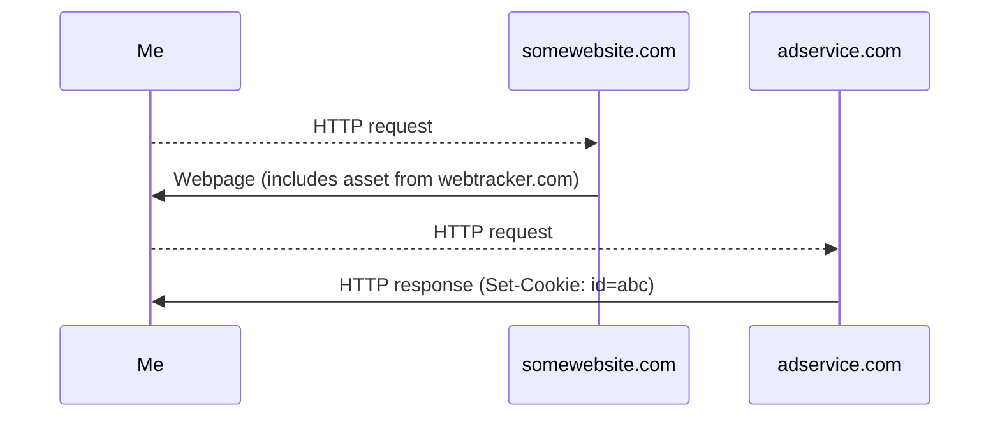

## Introduction

The primary means of monetization on the Web is via advertisements. Websites and services are often free to access, but will display visual or auditory advertisements before or during content. 15 second ads are displayed before videos; banner ads are displayed in the middle of articles. While advertisements are a centuries old way of paying for media, the internet introduced the possibility of tailored, **personalized ads**. Based on harvested data, an ad can be targeted for each user's preferences. Repeated viewing of dog care websites might indicate that the user owns a dog. The ad service can then select and display an ad from a local veterinarian. Because personalized ads present ads when customers are most receptive to their message, they cost a premium compared to un-personalized ads . The profitability of personalized ads has led to the creation of a vast Internet infrastructure for collecting users' personal information and browsing data.

## Web Tracking

### IP Address Tracking

Each computer on a network is assigned a unique **IPv4 address**, with the first $0 \leq k \leq 32$ bits inherited from the network and the last $32 - k$​​​​​​​​ bits being specific to the computer. Any messages sent across the Internet are broken up into packets, which include the source and destination IP addresses in their headers.


An IP packet from <https://www.khanacademy.org/computing/computers-and-internet/xcae6f4a7ff015e7d:the-internet/xcae6f4a7ff015e7d:routing-with-redundancy/a/ip-packets>.

Because IPv4 addresses are hierarchical (your computer inherits from the router, the router inherits from the regional ISP), knowing the IP address is sufficient to determine a user’s location at the city or even neighborhood level. This is how Google is able to estimate your location at the bottom of their search results page. However, IP addresses change when switching networks. This can make it difficult to track more mobile devices like laptops, which may switch networks frequently. Moreover, because many home and organizations routers use NAT to conserve public IPv4 addresses, the IP address associated with an HTTP request may come from a number of different devices on the network. So IP address tracking is un-invasive but not precise enough to determine much about a user.

### Device Fingerprinting

The problems with IP address tracking (for user identification) can be solved by supplementing IP addresses with more data. **Device fingerprinting** attempts to collect enough data about the user’s device in an attempt to uniquely identify the user. The data is often run through a hashing algorithm to generate a shorter **fingerprint**. Any old hashing algorithm will do—such as those built into programming languages—or a more complex cryptographic hash can be used. Multiple sites using device fingerprinting can then track a user by their fingerprint and record their Web history.

Much of this data can be harvested from the protocols used to access the Web: IP addresses, MAC addresses. TCP configurations and timestamps can be used to deduce the OS. For even more information, **browser fingerprinting** harvests data about and from the user’s browser using JavaScript: browser family/version, device properties such as screen size, and CPU/GPU information via HTML canvas elements. With enough attributes, devices can be finely distinguished.


<https://amiunique.org/fp> was able to identify me amongst millions.

### Third Party Cookies

A **cookie** is a small piece of data, in the form `name=value`, sent by a website to the browser that helps it identify that user. The cookie is inserted via a `Set-Cookie` field in the HTTP response. Every subsequent HTTP request to that website will contain the cookie following the `Cookie` header field. Cookies have a number of attributes:

- expiration date - future data cookie expires
- max-age - maximum time from insertion which cookie is valid
- domain - the URL in between ‘www.’ and /
- path - everything after .com, .org, etc.

Cookies are distinguished into 2 categories: **first** and **third party**. For example, suppose, I visit <u>somewebsite.com</u>. Cookies added by <u>somewebsite.com</u> are first party. If <u>somewebsite.com</u> includes assets (e.g. images) from <u>adservice.com</u>, the browser will send a HTTP request to the new domain. Any cookies added by <u>adservice.com</u> are third party. If every visited website includes assets from <u>adservice.com</u>, it can track my exact browser history. The first party website that includes that asset can relay its URL to <u>adservice.com</u> via, for example, HTTP GET query parameters.



Third party cookies are the best means of tracking users, as the ad service can be certain that each user is uniquely identified. However, they are easy to defeat. The browser can simply refuse to store the cookie when it encounters a `Set-Cookie`. Moreover, it can do this exclusively to third party cookies by checking whether the cookie originates from the first party website (e.g. the cookie domain must be <u>somewebsite</u>). Both [Firefox](https://blog.mozilla.org/en/products/firefox/todays-firefox-blocks-third-party-tracking-cookies-and-cryptomining-by-default/) and [Safari](https://webkit.org/blog/10218/full-third-party-cookie-blocking-and-more/) do this by default. Cookie blocking is also a setting which can be enabled in [Edge](https://support.microsoft.com/en-us/windows/delete-and-manage-cookies-168dab11-0753-043d-7c16-ede5947fc64d) and [Chrome](https://support.google.com/chrome/answer/95647?hl=en&co=GENIE.Platform%3DDesktop). In fact, the Chromium project has [committed to blocking third party cookies](https://blog.chromium.org/2020/01/building-more-private-web-path-towards.html) by default starting in 2022.

## FLoC

In the place of third party cookies, Google has proposed **Federated Learning of Cohorts** (FLoC) which groups users based on common interests . Users within each group would be indistinguishable, but their group membership would be sufficient to personalize advertisements. Each browser computes the interest cohort from local browsing data. Your Internet history is never transferred off your device. Because

> advertisers can expect to see **at least 95% of the conversions per dollar spent when compared to cookie-based advertising** [emphasis in original]

there would be no need to track users across the Web. This prevents an ever escalating arms race, where advertisers turn to device fingerprinting and more nefarious schemes to target ads.

### API

The API for FLoC consists of a single new function attached the `Document` interface, which represents a webpage loaded in the browser . It returns a `Promise`; that is, the function is asynchronous. The exact implementation of this new function is not standardized. Different browsers could have different clustering algorithms.

```javascript
partial interface Document {
    Promise<;InterestCohort>; interestCohort();
}
```

The `InterestCohort` is a user's assigned interest group. It consists of an

- **interest cohort id** - 32 bit integer representing the interest cohort (there does not necessarily need to be $2^{32}$ possible interest cohorts)
- **interest cohort version** - identified algorithm used to generate interest cohort ID.

```javascript
dictionary InterestCohort {
    DOMString id;
    DOMString version;
}
```

### Federated Clustering

Behind the API is a federated clustering algorithm that assigns a $p$​​-bit interest cohort ID to a $d$​-dimensional browsing history vector $x$​. Note that, because interest cohort IDs are 32 bit integers, $p \leq 32$​. A cohort ID is **k-anonymous** if it is shared by at least $k$​ users. That is, the interest cohort associated with that ID is a size $\geq k$​. In , Google proposes 3 federated clustering algorithms.

**SimHash** is a locality sensitive hashing algorithm first developed for Web crawling . The $i$th bit of the hash is

$$
H(x)_i =
\begin{cases}
    0 & w_i \cdot x \leq 0 \\
    1 & w_i \cdot x > 0
\end{cases}
$$

where $w_1, \dots, w_p$ are random unit vectors. Geometrically, each unit vector $w_i$ defines an orthogonal hyperplane $\\{y : w_i \cdot y = 0\\}$. Together they partition the $d$-dimensional space into $2^p$ subsets which have unique hashes. SimHash has the property that close vectors are more likely to be assigned to the same cohort. The probability that two vectors $x_1 \neq x_2$ have the same hash is

$$
\Pr(H(x_1) = H(x_2)) = \left( 1 - \frac{\theta}{\pi} \right)^p
$$

where $\theta = \cos^{-1}\left( \frac{x_1 \cdot x_2}{\|x_1\|\|x_2\|} \right)$ is the angle between the two vectors.

This fact is not hard to see. Since the $w_1, \dots, w_n$​​​​​​ are independent, it suffices to show that $\Pr(H_i(x_1) = H_i(x_)) = 1 - \frac{\theta}{\pi}$​​​​​​. Fix $x_1, x_2 \in \mathbb{R}^d$​​​​​​. The vector $w$​​​​​​ defines a hyperplane $P = \\{x \in \mathbb{R}^d : w_i \cdot x = 0\\}$​​​​​​ which partitions $\mathbb{R}^d$​​​​​​ into two sets. If $x_1$​​​​​​ and $x_2$​​​​​​ lie on opposite sides of $P$​​​​​​, then $H_i(x_1) \neq H_i(x_2)$​​​​​​. Since $P$​​​​​​ must be between $x_1$​​​​​​ and $x_2$​​​​​​, there are $\theta$​​​​​​ possible orientations of $P$​​​​​​. However, for every hyperplane, there are two unit vectors that produce the hyperplane. So there are $2\theta$​​​​​​ possible directions for $w$​​​​​​ out of a total of $2\pi$​​​​​​. Thus, $\Pr(H_i(x_1) \neq H_i(x_2)) = \theta/\pi$​​​​​​. By the complement rule, $\Pr(H_i(x_1) = H_i(x_2)) = 1 - \theta$​​​​​​.


The vectors are in black. The possible dividing hyperplanes and associated unit vectors are in red. The negative unit vectors are in blue.

The size of the interest cohorts depends on $p$. For large $p$, there are fewer, larger interest cohorts which better preserve privacy but are less useful to advertisers. For small $p$​, there are more, smaller interest cohorts of greater utility to advertisers that potentially violate k-anonymity. **SortingLSH** reduces this dependence through a central coordinating server. Let $h_1, \dots, h_n$ be hashes generated by SimHash, sorted in lexicographical order. Contiguous groups of $k$​ hashes are assigned to the same cohort. This way k-anonymity can be guaranteed.

The final algorithm proposed is **affinity hierarchical clustering with centroids**. This is a fully centralized clustering algorithm.

1. A graph is constructed with browsing histories as nodes and weighted edges connecting similar histories. In , the nodes are connected to the $k$​​​​​-nearest neighbors with cosine similarity weights. This requires full access to all users' browsing histories.
2. Clusters are formed hierarchically by joining highly connected smaller clusters. This is done until all clusters reach a minimum size. From these clusters, we extract the centroids.
3. Users are assigned to the cohort whose centroid is the closest.

A brief analysis of these 3 algorithms is conducted in , which I won't reproduce here. In short, affinity hierarchical clustering with centroids and SortingLSH create the best interest cohorts but SimHash was good enough as a starting point for browsers.

## Reception

In 2021, Google has begun trials for FLoC in Chrome $\geq 89$ using **PrefixLSH** on domain names with a centralized server that blocks the API from return a cohort ids when the cohort is too small. (PrefixLSH starts off with 2 cohorts based on whether the SimHash starts with 0 or 1. Cohorts are split once they exceed 2000 users.) In response, privacy advocates have raising concerns with FLoC and its implementation .

- The cohort IDs could be used in conjunction with other device data to uniquely identify users. Google has pledged to fight device fingerprinting as part of its broader Privacy Sandbox.
- Every website sees the same cohort ID, enabling to access irrelevant information about a user's interests. Suppose a cohort ID 123 is associated with young Democratic women. Even if accessing a medical site, it might be able to determine your political affiliation. This is necessary for FLoC to work, since a user should see the personalized ads across unrelated websites.
- Cohort IDs could be used to discriminate. In fact, targeted advertising has already been used for this purpose . To prevent cohort IDs from exposing sensitive data, Google aims to [monitor cohorts](https://github.com/WICG/floc#excluding-sensitive-categories) and adjust the clustering algorithm in response.

No other browser has decided to support the feature, including all Chromium based browsers save for Chrome. This negative reception has led Google to [delay third party cookie ban](https://blog.google/products/chrome/updated-timeline-privacy-sandbox-milestones) until 2023.

## The Future of FLoC

At its heart, FLoC aims to preserve the current monetization structure of the Internet centered around personalized ads. To those who oppose the current Internet regime, FLoC is unacceptable. Groups like the Electronic Frontier Foundation would prefer an end to personalized ads , with users volunteering as little information as required to each webservice. Even though other browsers have declined to implement FLoC, Chrome has a plurality of browser market share. Google has the power to advance FLoC unilaterally. The company has strong incentive to make something like FLoC standard. Over 80% of their revenue comes from the sale of online advertising.

Perhaps the best justification for FloC is that it is a privacy preserving compromise with advertisers. By providing enough, but not too much, information about the user, its creators hope that websites won't turn to more nefarious means of Web tracking. This stops the otherwise endless arms race between privacy tools and advertisers. In particular, device fingerprinting is effective at isolating users while being difficult to stop, something even FLoC critics acknowledge . Unlike third party cookies, they cannot be easily blocked as they use JavaScript and HTML. Without either, many websites do not function.

The final version of FLoC, if the whole project isn't abandoned, will no doubt undergo major changes from its current state. Despite the name, the current version of FLoC does not incorporate any federated learning. Because devices only contain a single browsing history, little learning can be done on device. Deep learning is more likely to appear in the form of centralized unsupervised learning on large datasets of browsing histories. These models would then be embedded into the browser releases. For example, contrastive learning could be used to train a model that embeds browsing histories such that similar histories are close while dissimilar ones are far apart. Browsing histories could be permuted slightly, or domain names replaced with synonyms. The embedding space is then divided into cohorts.

## References


