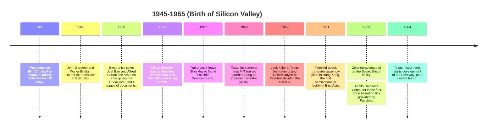
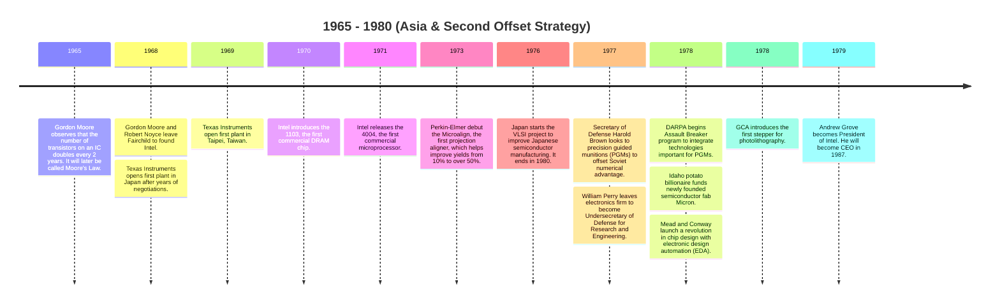
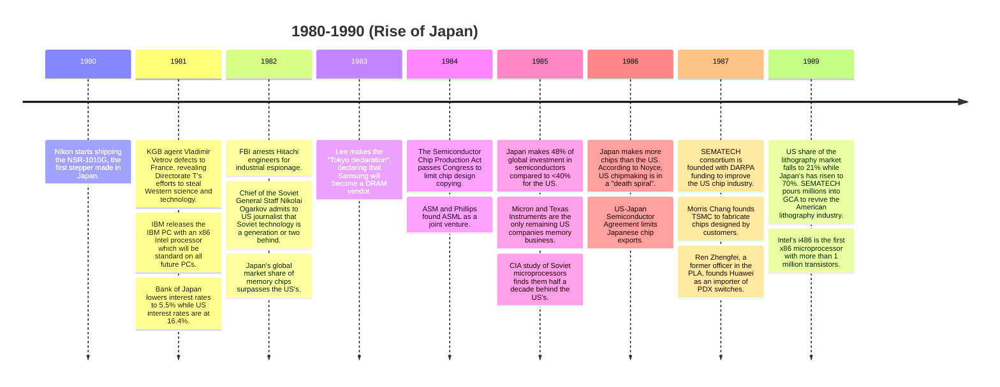
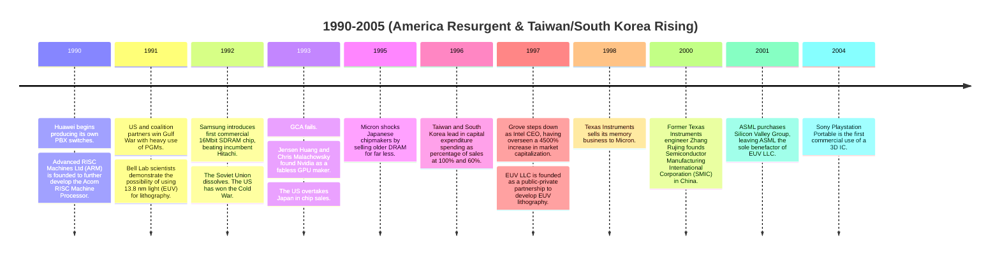
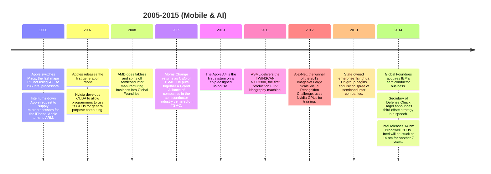
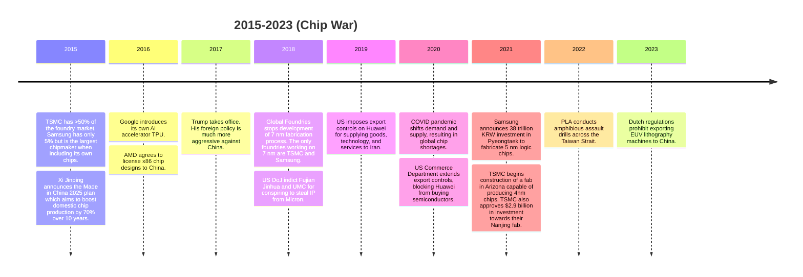

A large portion of my "reading" this year has been in the form of audiobooks instead of paper books. Books that I listened to are denoted with :headphones:. Books that I read are denoted with :book:.

## Essay Collections

### The Anthropocene Reviewed - John Green :headphones:

Spotify Premium comes with audiobooks and has been promoting them on my home page. I figured I'd start with _The Anthropocene Reviewed_. I like watching vlogbrothers videos and the author, John Green, is a vlogbrother. I like listening to podcasts and _The Anthropocene Reviewed_ started as a podcast. I thought its origin would lend itself towards easy consumption as an audiobook.

_The Anthropocene Reviewed_ is a collection of essays on different aspects of the human-made world. Topics range from the abstract ("Humanity's Temporal Range") to the concrete ("Lascaux Cave Paintings"), from the mundane ("Diet Dr Pepper") to the profound (The Orbital Sunrise), and from the positive ("The Smallpox Vaccine") to the negative ("Staphylococcus aureus"). Nominally, the goal of each essay is to rate the subject on a 5 star scale, but, really, each essay is a vessel for John to explore different aspects of the human experience.

_The Anthropocene Reviewed_ is also a deeply personal work, verging on autobiography. Many reviews center around significant events in John's life. [Auld Lang Syne](https://www.youtube.com/watch?v=Wgh8Gfs2S7M) revolves around John's relationship with Amy Krouse Rosenthal and her passing. Googling Strangers revolves around John's time as a hospital chaplain and a particular time when he had to comfort the parents of an infant with severe burns.

The book has great highs; I loved the reviews of "Jerzy Dudek's Performance on May 25, 2005", "Harvey", "Auld Lang Syne", "Indianapolis", and "Googling Strangers". It drags in spots as John tries to extract meaning from places where there isn't much to be found. The approach which works so well for Sunsets doesn't work as well for "Scratch 'n' Sniff Stickers". I found myself struggling to pay attention while these reviews played. Fortunately, most of the reviews are good, and the bad reviews are sparse. After each bad review is a review that makes you reconsider life in the Anthropocene.

I give _The Anthropocene Reviewed_ 4 and a half stars.

### Let Me Tell You What I Mean - Joan Didion :book:

_Let Me Tell You What I Mean_ is the last collection of essays from one of the greatest essayists in the history of literature. It gathers 12 previously published essays written between 1968 and 2000. The essays cover a spread of topics, but the topic of writing is given the most attention. Four of the 12 essays and 65 out of 147 pages deal with this topic.

"Alicia and the Underground Press" is an essay where Didion admires how underground newspapers write at the reader and don't pretend to be objective. "Telling Stories" is the backstory behind some of Didion's short story work from the 1960s. "Last Words" is an analysis of Ernest Hemingway, whom Didion respects for his writing skill. Even more than a love letter to Hemingway, "Last Words" is an argument for the power of sentences and the craft of writing as composing words into those sentences.

The star of the collection though is a not an essay but a lecture titled [_Why I Write_](https://www.nytimes.com/1976/12/05/archives/why-i-write-why-i-write.html) given by Didion in 1975[^1]. That year, she returned to her alma mater, some 20 years after graduating, as a [Regents’ Lecturer](https://vpf.berkeley.edu/faculty-fellowships/regents-lectureship-program), a now retired program that invited distinguished people outside the circles of academia to come speak at UC Berkeley. The

> reversal of positions that should have been settling, moved me profoundly, answered no questions but raised the same old ones

she would later write in _Pacific Distances_ in _After Henry_. Despite her insecurity, _Why I Write_ masterfully expresses the Didion philosophy of writing in the Didion style of writing. Writing is an act of aggression. The writer imposes their views on the reader. Writing is about images. The picture tells you how to arrange the words and the arrangement of the words tells you what's going on in the picture. The points are made with anecdotes, where even the most subtle detail is crucial to the meaning of the essay. She repeatedly uses connective phrases to give her another chance to explain herself. Her writing often reads like she is lecturing to you, so it is not surprising that her lecture doesn't read very differently than her essays.

> In many ways
>
> I stole the title not only because the worlds sounded right but because they seemed to sum up, in a no-nonsense, kind of way all I have to tell you.
>
> In short
>
> By which I mean
>
> Just as I meant "shimmer" literally I mean grammar literally.
>
> Let me show you what I mean.

At the end, like many Didion essays, she has one more punch, a final idea she wants to stick in your head. Writing is a process of discovery, powered by a deep impulse to construct meaning and impose narrative on experience. We tell ourselves stories in order to live.

I don't think _Let Me Tell You What I Mean_ is Didion's best work. That title has been claimed long ago by either _Slouching Towards Bethlehem_ or _The White Album_ although my favorite is _After Henry_, specifically the opening elegy for longtime editor Henry Robbins. But it is a good work, buoyed by the large number of essays from 1960s when Didion was, frankly, better. It is an essential work that every Didion fan should own.

## History

### Chip War: The Fight for the World's Most Critical Technology - Chris Miller :headphones:

_Chip War_, despite its title, is only partly about the current US-China chip war. On one side is the US and its allies trying to prevent China from developing the capabilities to produce cutting edge chips. On the other side is China trying to achieve self-sufficiency in chip manufacturing. _Chip War_ is really the story of the entire semiconductor industry from the invention of the transistor to a world where billions of people carry billions of transistors on them at all times. I charted the major events mentioned in the book in the timelines below. The titles are my own.

I knew some of the history that Miller talks about: the invention of the semiconductor at Bell Labs, the traitorous 8, Moore's law, and the founding of Intel are Silicon Valley lore. But most of the events in the book were new to me. I didn't know how early Silicon Valley companies offshored manufacturing to Asia, how Japan overtook the US as the global leader in chipmaking, or how America—with Taiwan and South Korea—retook the crown. I certainly knew nothing about the Soviet semiconductor industry; I assumed there wasn't one. Another surprise was the centrality of semiconductors to economies and militaries by the 1980s. Then, as now, the US government made an effort to preserve the US chip industry against Japanese and Asian competition because it needed a secure supply of chips for its missiles, planes, and ships.

Another theme of the book is the global semiconductor supply chain. There are the foundries that manufacture chips, the fabless semiconductor companies that design chips, the lithography and materials companies that make the machines that make the chips, and the software companies that develop electron design automation (EDA) software. Yet, due to the ever greater capital required to shrink chips, the supply chain has consolidated into a few firms in a few countries. Taiwan and South Korea are home to the biggest fabs: TSMC and Samsung. The maker of the only EUV lithography machine, ASML, is Dutch. The best chip designers and chip design software developers are American: Nvidia, AMD, Qualcomm, Cadence, Synopsys, and Mentor Graphics. In fact, in this ecosystem, Intel—historically America's leading chipmaker—is unusual for designing and fabricating its own chips.

These firms are bottlenecks in the chip supply chain and the objects of the US-China chip war. By limiting access to EDA software and lithography machines, China won't be able to design and fabricate domestic chips. Then by imposing export restrictions, China won't be able to buy the most advanced chips. Without the most advanced chips, China will be behind its rivals in technologies like AI, robotics, and big data. While these measures will hurt, I doubt China will be set so far behind. [Already, China can make 7 nm chips.](https://www.bloomberg.com/news/features/2023-09-04/look-inside-huawei-mate-60-pro-phone-powered-by-made-in-china-chip) _Chip War_ is full of examples of countries investing in their semiconductor industries, catching up, and exceeding incumbents. Why should China be so different?

The computer chip is the hardware that powers the world of software in which we spend our lives. _Chip War_ is a great book that tells the twists and turns of how that chip became the world's most crucial technology.

### Ours Was the Shining Future: The Rise and Fall of the American Dream - David Leonhardt :headphones:

_Ours Was the Shining Future_ covers the rise of the New Deal coalition and system that created the largest middle class in history and fall to the neoliberal order that has destroyed it. Leonhardt attributes the triumph of the New Deal order to the success of labor in the 1930s and 1940s. Not only had they learned lessons from the fights of previous decades, the timing was right—the Great Depression weakened business's faith in unrestricted capitalism while World War II increased the leverage labor had to strike and negotiate deals. Crucially, they had political support from a friendly Roosevelt administration which passed the National Labor Relations Act of 1935 that legalized the right to strike and intervened on behalf of labor in disputes between owners and workers.

The downfall of the New Deal order, then, starts with the emergence of the New Left that was more preoccupied with cultural issues relevant to college graduates than working class issues like crime and disorder. Because of the New Left, Democrats failed to prioritize legislation and executive action that would strengthen the labor movement. The labor movement itself had become corrupt and decadent through the middle of the 20th century, helmed by ineffective leaders unconcerned with expanding unions. At the same time, economists at elite institutions were developing an alternative theory to Keynesian economics that would then become prominent during the stagflation of the 1970s. Executives and economists worked together to push a model of laissez faire capitalism that would increase their profits by dismantling government regulation. Unrestricted immigration helped suppress the wages of the most vulnerable Americans.

For Leonhardt and many progressives, the solution to the current problems is a return to the New Deal. While good parts of the New Deal were certainly abandoned, I wonder if progressivism's inability to think of novel solutions is a creative failure akin to the Rise of Skywalker's resurrection of Palapatine as the big bad. The circumstances of the 21st century are much different than the 20th century. The days of thousands of workers together on the same factory floor are over. Factories now are more efficient and more automated. The average worker now works in a service sector jobsite like a restaurant or grocery store. New technologies like AI threaten to displace high income white collar workers that were previously safe. The solutions for the 21st century must be different than those for the 20th century.

### SPQR: A History of Ancient Rome - Mary Beard :book:

Ancient Rome is the substrate of Western Civilization. From Roman law which lives on as civil law—the legal system of most countries, to the Roman Republic which inspired the modern republic, to the Roman Empire whose legacy many states tried to carry on, the influence of Ancient Rome is undeniable. SPQR covers the history of ancient Rome from its founding to 212 CE when Caracalla grants every free man in the Roman Empire citizenship. The book is structured into chapters which cover a distinct period of Roman history, though this structure breaks down at the end. Within each chapter, the book is structured by topic. For example, the second chapter goes from Cicero to the story of Romulus and Remus to the meaning of Remus' murder to the Rape of the Sabine Women to Aeneas and so on... The non-linear structure makes it easier to track the big ideas Beard is trying to communicate but harder to track what happened when. Much of the book assumes that the reader has some familiarity with the conventional history and stories about Rome. This makes SPQR less accessible for readers who don't know much about Roman history.

The book is organized around two questions:

1. **Who is Roman?** Throughout the book, Beard traces the expansion of Rome but also Roman citizenship from a small settlement to a large metropolis to Italy and beyond. It's no surprise then that Beard ends the book in 212 CE, when Caracalla grants every free man in the Roman Empire citizenship, which settles the matter. Everyone is Roman. Of course, if every Roman subject is a Roman citizen, it ceases to be a meaningful category. Beard describes how Roman society split along a new division between the upper and lower classes.
2. **What does it mean to be Roman?** The second chapter, about the founding of Rome, is a good example. It is more interested in what the myth of Romulus and Remus says about the Roman people than whatever truth lies behind the myth. Does the fratricide of Remus by Romulus doom Rome to civil war? What does it mean that the first Roman marriages involve rape, or at least kidnapping?

One thing I was surprised by is the amount of historiography. Beard spends much of the early chapters relaying how unreliable our sources for early Roman history are. She does this for the obvious case of the founding of Rome by Romulus and Remus—what she-wolf have you seen suckle 2 infants—but also for the less obvious cases of the kings of Rome and Rome's early expansion. Beard points out that even for significant events like the Battle of Cannae, we only have contradictory accounts from historians written decades to centuries later. We are not even sure where the battle took place and the current geography is not the same as it might have been 2 millennia ago. Only as Roman history nears the first century BCE, she claims are there enough concurrent records to confidently construct the timeline of events. I found it fresh for a history book to tell you the limits of a narrative rather than presenting a narrative and seducing you into believing it.

## Literary Fiction

### Intermezzo - Sally Rooney :book:

I thoroughly enjoyed _Normal People_ in 2019. I skipped _Beautiful World, Where Are You_ (BWWAY) after some reviews called it more of the same and not quite as good as _Normal People_. I was intrigued, then, when I heard that _Intermezzo_ was an evolution in her work. Instead of focusing on romantic lovers, the primary relationship that organizes the books are 2 brothers. Peter is the older brother. Ivan is the younger brother. Peter is a successful 32 year old Dublin lawyer. Ivan is a chess prodigy whose career has stalled, taking data analyst gigs in the meantime to fund his playing. Peter has had many romantic relationships with beautiful women, currently dating a pretty 23 year old, but still close friends with longtime girlfriend now ex Sylvia. Ivan has had no romantic relationships, went through an incel period in his late teens, but gets into a relationship with a 36 year old woman Margaret estranged from her alcoholic husband. Peter gets along with people; he knows what to say. Ivan never does.

The book's chapters alternate their focus on each brother, starting and ending with Peter. Rooney's style changes for each brother. For Peter's chapters, the sentences are choppy and often incomplete. Often missing a subject or verb. She writes like people text. Took me a while to settle into the book.

> Didn't seem fair on the young lad. That suit at the funeral.

For Ivan's chapters, the sentences are long, flowing, and introspective. The style suits the tendency for Ivan's and Margaret's thoughts to ramble. The text felt familiar; it wouldn't be out of place in any other Rooney novel. I enjoyed reading these chapters.

> Ivan is standing on his own in the corner, while the men from the chess club move the chairs and tables around.

Either way, there are no quotation marks.

In [my review](https://georgerpu.github.io/blog/2019/books/) of _Normal People_, I said that it was difficult to relate to a book about the romantic tension between 2 people when I had never been in a romantic relationship. I did not have a problem relating to the plot and characters of _Intermezzo_. I could see parts of myself in Peter and Ivan, and not necessarily parts I liked. At times, I had to stop reading because I cringed at something the characters thought, said, or did—because I too had thought, said, or done those things. And I have a brother. Fraternal and familial conflict is something I grasp. Much of the tension between the siblings, aside from Peter's judgement of Ivan's relationship with an older woman, is a result of events that happen before the present of the novel. [Indeed, the greatest drama here comes from conversations taking place under the pressure of life-changing events in the novel’s prehistory](https://www.theguardian.com/books/2024/sep/22/intermezzo-by-sally-rooney-review-is-there-a-better-writer-at-work-right-now).

The brothers eventually reconcile. They get some happiness in their romantic lives, but their lives remain open problems, full of unanswered questions. But that's life; we never reach a point which our lives lie before us as a clearly marked open road, never have and never should expect a map to the years ahead[^2]. Whether Ivan settles down with Margaret or Peter can sustain a throuple is left to the posthistory, perhaps to be told in a sequel someday. _Intermezzo_, as the title suggests, is sandwiched in the fluid, messy, glorious middle.

## Memoir

### Best Minds: A Story of Friendship, Madness, and the Tragedy of Good Intentions - Jonathan Rosen :headphones:

_Best Minds_ is a memoir about Michael Laudor, childhood friend of the author Jonathan Rosen, famous for [overcoming schizophrenia and attending Yale Law School](https://www.nytimes.com/1995/11/09/nyregion/voyage-bedlam-part-way-back-yale-law-graduate-schizophrenic-encumbered-invisible.html) and infamous for [murdering his pregnant girlfriend](https://www.nytimes.com/1998/06/19/nyregion/from-mental-illness-to-yale-to-murder-charge.html). It is also about mental illness and the way society perceived it in the late 20th century. When describing their joint childhoods, Rosen intersperses their hijinks with news stories of mentally ill criminals. When describing his time in graduate school getting a PhD in English, he notes the ways mental illness influenced the French post-structuralists. When describing Michael's time in a New Rochelle group home, he deep dives the network (of idealistic psychiatrists) pushed community psychiatry as an alternative to mental hospitals. When Michael enters Yale Law School, Rosen describes the evolving ways the law has viewed mental illness.

The book is deeply critical of deinstitutionalization and a mental healthcare system that can only force Michael Laudor to be treated after a horrific act of violence, killing his girlfriend—nearly sawing off her head—but not before. Michael Laudor was passed between psychiatrists, psychologists, group homes, and institutions; many were concerned about his declining mental health. Yet none had the power to institutionalize him or force him to take antipsychotic medication. The abuses of mental asylums are well known but giving the mentally ill unlimited freedom when their disease prevents them from making rational decisions has not been a solution either.

### A Promised Land - Barack Obama :headphones:

Barack Obama has written many books over the years. _Dreams from My Father_ was published in 1995 as he embarked on an Illinois Senate campaign. _The Audacity of Hope_ published in 2006 communicated Obama's beliefs following his rise to stardom at the 2004 Democratic National Convention. _Change We Can Believe In_, published in 2008, was a manifesto for his presidential campaign. All of these books served a political purpose. _A Promised Land_, published 4 years after the end of his second term, is the first book by Obama that isn't trying to advance a cause. It is a reflection but also a justification of Obama's time in office.

The book starts off retreading familiar ground for those who have read his other books. Chapter 1 covers his childhood in Hawaii to law school at Harvard. It has my favorite quote.

> Enthusiasm makes up for a host of deficiencies

Chapter 2 describes his courtship to Michelle, foray into the Illinois state senate, and failed run for the House of Representatives. Chapter 3 describes his successful run for the Senate and his [legendary speech](https://youtu.be/ueMNqdB1QIE) at the 2004 Democratic National Convention. Chapter 4 describes his decision to run for President. "Part 2: Yes We Can" is where the new territory begins.

- Part 2 covers his campaign.
- "Part 3: Renegade" covers the early days of his presidency.
  - In Chapter 10, Obama chooses his cabinet.
  - Chapter 11-13 focus on recovering from the Great Recession.
- "Part 4: The Good Fight".
  - Chapter 14 covers Obama's first G20 summit.
  - Chapter 15 covers Obama's adjustments to the War on Terror from the Guantanamo Bay detention center (Gitmo) to a tour of the Middle East.
  - Chapter 16-17 covers the passage of the Affordable Care Act.
- "Part 5: The World as It Is" focuses on foreign policy.
  - In Chapter 18, Obama reviews Stanley McChrystal's Afghanistan plan.
  - Chapter 19-20 covers relations with Iran and Russia and China.
  - Chapter 21 covers climate change.
- "Part 6: In the Barrel".
  - Chapter 22 covers the sluggish recovery, the Euro crisis, and financial reform.
  - The first half of Chapter 23 covers the Deepwater Horizon oil spill. The second half covers McChrystal's firing, their failure to close Gitmo, and the upcoming midterm elections,
  - Chapter 24 covers a trip to India and the lame duck session.
- "Part 7: On the High Wire" covers conflicts in the Middle East—Palestine-Israel, the Arab Spring, Libya intervention, and the killing of Osama bin Laden.

A more detailed summary is available [here](https://jsilva.blog/2021/04/27/a-promised-land-summary/).

_A Promised Land_ is an illuminating book. Obama goes into great detail to describe the experience of becoming and being President: what it's like to campaign, the toll it exacted on his family, how it felt to be elevated as a symbol, the pressure of making life and death decisions. While I wasn't surprised at how Obama described becoming President, being President of the United States is much different than I expected. Many of the book's [229,632 words](https://howlongtoread.com/books/9707722/A-Promised-Land) are devoted to staffing decisions. Being President is about the ceremony as much as the day to day practicalities. The Presidency is scrappy[^3]. And for all the information and planning and debate that happens, being President sometimes comes down to gusto and guts.

A story I'll never forget comes from the 2009 UN Climate Change Summit or the Copenhagen Summit. The leaders of the China, Brazil, India, and South Africa were holding a meeting to hide from Obama and wait out the conference. Obama's team learns of this and crashes the room they were having a meeting in. In a 2 minute speech, Obama threatens to blame them for the failure of the summit unless they agree to their proposal. After a pause, the leaders read the American proposal. On the spot, they agree to the proposal conditional on some changes. Immediately, Obama headed back to the Europeans to get them to agree to the requested changes. Out of all this chaos, came the Copenhagen Accord which led to the Paris Accord.

Obama is a gifted writer and well-versed reader. _A Promised Land_ is full of literary allusions.

> My supporters lack all conviction, while my opponents are full of passionate intensity.

Chapter 11, an allusion to [_The Second Coming_](https://www.poetryfoundation.org/poems/43290/the-second-coming)

> All the sound and fury around Dodd-Frank signified nothing more than the usual Washington scrum

Chapter 22, an allusion to [_Macbeth_](https://www.poetryfoundation.org/poems/56964/speech-tomorrow-and-tomorrow-and-tomorrow)

The book provides background information for everything. New characters always come with a description of their appearance. References to historical events always come with a summary of the historical event. The book drags in places where Obama over-explains.

The memoir also defends the less popular parts/mistakes of his presidency. Obama justifies not going after the bankers responsible for the Great Recessions by arguing that it would require a violence to the social order that would outweigh the benefits. Obama criticizes anti-Bush protesters protesting against Gitmo on the day of his inauguration, a policy that he himself was against. In general, Obama comes off as a more moderate candidate than his campaign message of hope and change implied. Obama is often unwilling to challenge the status quo to push for more radical reform.

Yet, Obama also never stops believing in the possibility of progress in America or wavers in his vision for a more equal, just nation. He reflects on the meaning of his time in office. He is unafraid to kill to protect the country he loves, even invading another nation to kill the man responsible for thousands of American deaths.

I look forward to the remainder of Obama's presidential memoirs.

### Sorry I'm Late, I Didn't Want to Come - Jessica Pan :headphones:

What can I say, I am a sucker for audiobooks narrated by their authors.

It wasn't the title _Sorry I'm Late, I Didn't Want to Come_ but its subtitle _One Introvert's Year of Saying Yes_ that caught my eye when Spotify recommended it to me. I am an introvert. Personality tests usually put me somewhere in the 33rd to 10th percentile of extraversion or the 67th to 90th percentile of introversion. I tick-off all the attributes of an introvert: reflective, prefers few close friends, dislikes large parties, can go days without talking to people. Introversion was such a constant in my life that being even an ambivert seemed impossible.

At the beginning of the book, Pan has the same mentality. Then, her friends move away from London, and she becomes reclusive after quitting her job. No longer able to tolerate her shyness and introversion as the excuse preventing her from getting the things she wanted—a good job, friends, and new experiences—Pan tries extroverting. Over the course of a year she talks to strangers ([and finds they like her more than she thinks](https://bigthink.com/surprising-science/why-we-make-better-first-impressions-than-we-think/?utm_source=pocket_collection_story)), tells a story on stage, friend-dates, networks, tries improv and standup comedy, and solo travels—all stereotypically extroverted activities. At her standup comedy class, she remarks about extroverts:

> I finally found them. Here they all are. Just kidding, they’ve always been easy to find. They’re so loud.

Each of these activities is its own chapter. I found the first half of the book super engaging, listening to Pan overcome her extreme shyness, she once cried at her own surprise birthday party because there was too many people, to end up striking up a conversation with an elderly French man. The second half of the book was less interesting. There are 3 chapters about standup comedy. Despite Pan trying to spin the tale otherwise, I am not convinced Pan enjoyed her trip to Portugal to try psychedelics.

The book has so many takeaways about social relations. Listing them all is beyond the scope of this post. But _Sorry I'm Late, I Didn't Want to Come_ had 2 philosophical takeaways that I wanted to write down:

1. I found Pan so fun and captivating in her narration that it is hard to believe others in her actual life could meet her and dismiss her as boring because of her shyness. **Each person is living a life as vivid and complex as your own**.

2. In moments throughout the book, Pan has regrets over what her shy introversion kept her from. But alas, there are no do-overs in life.

   > **I do not want to regret not doing the thing, whatever the thing, anymore.**

## Politics

### Politics and the English Language - George Orwell :book:

"[Politics and the English Language](https://www.orwellfoundation.com/the-orwell-foundation/orwell/essays-and-other-works/politics-and-the-english-language/)" is not a book but an essay by George Orwell against bad English. Orwell's rails against the usual suspects—wordiness, pretentious diction, cliche phrases[^4], meaningless words—but also some unusual ones—dying metaphors, verbal false limbs and some controversial ones: passive voice. The bad habits Orwell notes are all too common in academic writing.

These features of bad writing become an asset when writing about politics. When a totalitarian state decides to eliminate its internal critics as enemies of the revolution, its defenders can turn to academic, abstract language to cover up the brutal reality of elimination: bullets traveling through the heads of hundreds of thousands.

> While freely conceding that the Soviet régime exhibits certain features which the humanitarian may be inclined to deplore, we must, I think, agree that a certain curtailment of the right to political opposition is an unavoidable concomitant of transitional periods, and that the rigours which the Russian people have been called upon to undergo have been amply justified in the sphere of concrete achievement.

When minority ethnic groups on the frontiers of new nations-states are forced off their land, the majority ethnic group can turn to euphemism.

> transfer of population or rectification of frontiers

When an empire decides to bomb villages and round up civilians into concentration camps to crush a rebellion in a colony, the public relations officers can turn to a word of Latin origin that invokes peace.

> pacification

It is this reason that Orwell rails so hard against bad English. It is dangerous. Good English matters not simply because it makes for better literature or helps us communicate more clearly at work but because our freedoms depend on it. Good language, not just the English language, helps reveal truth. Bad language not only obfuscates the truth but attempts to disguise falsehoods as its opposite.

## Software Engineering

### Designing Data Intensive Applications: The Big Ideas Behind Reliable, Scalable, and Maintainable Systems - Martin Kleppmann :book:

_Designing Data Intensive Applications_ (sometimes abbreviated as DDIA) is maybe the definitive book on system design. I feel like every software engineer I run into has read this book. This makes sense since the book is great. It's broad, covering a vast amount of content, from databases to file formats to distributed systems, but also deep. The book goes into different types of databases and how they can be used, but also their internals. In fact, Chapter 3 exclusively covers the data structures used in databases: Hash indices, SSTables, LSM trees, B trees, and columnar storage. I definitely wish I read this book earlier in my career or even in college. Many of the lessons I have learned through experience are recognizable in the pages of DDIA. For example, the guidance on unbundling databases and designing applications around dataflow took me several years to learn at work.

However, DDIA shows its age in certain places. Certain topics are no longer relevant. MapReduce has been succeeded by tools like Spark. Data warehouses are mentioned but data lakes are not. There isn't much devoted running advanced algorithms or training machine learning models on data. But in my opinion, the biggest omission is the cloud[^5]. Rarely do software engineers need to create distributed data systems consisting of servers anymore. It's more common to pay for and use a cloud service that offers a distributed data system like Firebase ready-to-go. The cloud makes understanding the fundamentals in DDIA less important but also introduces novel system design problems such as how to mix cloud services with in house servers.

Overall, DDIA is a strong textbook on system design that I would recommend to every software engineer. Kleppmann is working on a new version of the book, which I look forward to reading when it's released.

### System Design Interview - Alex Xu :book:

_System Design Interview_ is the resource for preparing for system design interviews. It was also the first resource for system design interviews, written by Xu after failing to find a satisfactory system design interview preparation resource for his own study. I cannot speak on its utility for system design interviews as I have not participated in many. However, I do believe that is an underrated resource for junior software engineers learning how to design software systems.

_System Design Interview_ presents a 4 step framework for system design interviews.

1. Understand the problem and establish the design scope.
2. Propose high-level design and get buy-in.
3. Design deep-dive.
4. Wrap-up.

These match the steps of gathering requirements, high level design + review, low level design + review, and implementation when actually designing software. Thus, the 12 case studies in _System Design Interview_ are also 12 examples of design documents. I especially like the case studies "Design Rate Limiter", "Design Consistent Hashing", and "Design Google Drive". Each case study has detailed but clear diagrams that make me feel like I can implement the system Xu has designed. Each chapter has links to learn more.

I have a few qualms with the book.

- The first 2 chapters and case studies present foundational concepts but never go in depth.
- Many case studies don't present alternate designs. Design a Web Crawler is an example. Designing software is often about picking a design out of a larger design space that makes the right tradeoffs: maximizing the attributes you care about most while compromising on less important properties. Alternate designs are useful to understand tradeoffs.

- The book doesn't mention technologies which are now ubiquitous: serverless functions, containers, serverless workflows, NoSQL databases, and, the biggest omission, data pipelines. There is no discussion of data lakes, data warehouses, ETL jobs, or just batch processing systems in general, except for Design a Web Crawler.

These hold the book back, causing my opinion to be lower than many others[^6]. Still, I think it is good starting point for software engineers looking to master system design and system design interviews. For system design, I would recommend pairing it with other books, articles about systems from tech blogs, and system design experience at work or through personal projects.

---

[^1]: [The Autumn of Joan Didion ](https://www.theatlantic.com/magazine/archive/2012/01/the-autumn-of-joan-didion/308851/) is a great first hand account of the lecture by the daughter of a 1970s Berkeley professor and a great ode to Didion.
[^2]: "Pacific Distances". _After Henry_ - Joan Didion.
[^3]: Obama authorizes the military intervention in Libya from a staffer's unsecured cellphone.
[^4]: I am a fellow hater of cliches. Cliches are lazy. Using a cliche is communication by baggage. Rather than precisely arrange words to convey the desired meaning, you let the word choices of all the authors who have ever used the cliche determine the meaning.
[^5]: Martin Kleppmann also admits this in https://martin.kleppmann.com/2024/01/04/year-in-review.html.
[^6]: For an alternative perspective, see https://blog.pragmaticengineer.com/system-design-interview-an-insiders-guide-review/.
